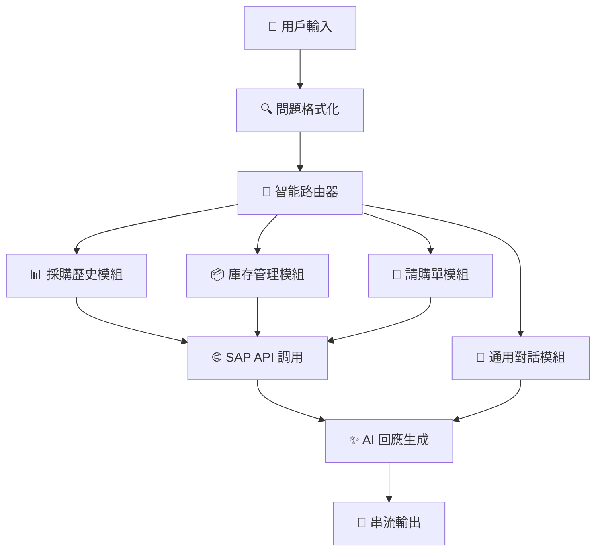
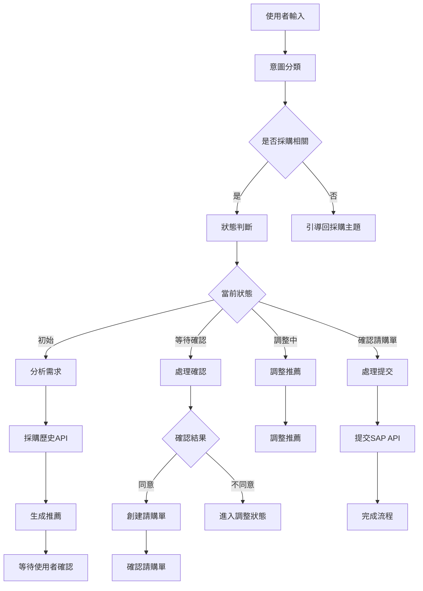

# 🚀 SAP AI Agent 企業智能助手

<div align="center">


**🎯 新一代企業級 SAP 智能助手 - 融合 AI 與企業管理的終極解決方案**

*✨ 雙引擎架構 | 🧠 智能路由 | 💬 對話式體驗 | 📊 數據驅動*

</div>

---

## 🌟 系統亮點

> **💡 這不僅僅是一個聊天機器人，而是您企業數位轉型的核心引擎！**

### 🔥 雙引擎智能架構
- **🤖 SAP Agent Engine** - 智能路由系統，精準識別用戶意圖
- **💬 Conversational Engine** - 對話式請購系統，全流程自動化

### ⚡ 核心技術優勢
- **🧠 智能路由系統** - 自動識別用戶意圖，精準調度至專業模組
- **⚡ 實時串流回應** - 毫秒級響應，流暢如真人對話
- **🔄 上下文記憶** - 深度理解對話脈絡，提供個性化服務
- **📊 數據驅動決策** - 基於歷史數據智能推薦最佳方案
- **🛡️ 企業級安全** - 多層安全機制，保護敏感業務數據

## 🎯 系統功能概覽

### 🤖 SAP Agent 智能助手
**功能模組：**
- 📊 **採購歷史管理器** - 智能查詢歷史採購記錄
- 📦 **庫存智能管家** - 實時庫存監控與預警
- 📝 **請購單流程管家** - 全自動請購流程管理
- 💬 **智能對話助手** - 自然語言交互界面

### 💬 對話式請購系統
**智能功能：**
- 🎯 **意圖識別** - 自動判斷使用者意圖和對話狀態
- 🔍 **產品推薦** - 基於採購歷史推薦最適合的產品
- 🧭 **流程引導** - 引導使用者完成完整的請購流程
- 🔄 **狀態管理** - 維護多使用者會話狀態
- 🎪 **主題控制** - 自動將偏離主題的對話導回採購相關內容

## 🏗️ 系統架構圖

### 🤖 SAP Agent 智能路由架構



### 💬 對話式請購流程架構



---

## 🎬 極速啟動指南

### 🛠️ 環境準備

```bash
# 🔧 克隆專案
git clone <your-repo-url>
cd sap_ai_agent

# 📦 安裝依賴
pip install -r requirements.txt

# 🔑 設定環境變數
export OPENAI_API_KEY="your-openai-api-key-here"
export OPENAI_BASE_URL="https://api.openai.com/v1"  # 可選
```

### 🚀 啟動序列

#### 第一步：啟動 SAP API 服務器 🌐

```bash
# 🚀 啟動 SAP 模擬 API 服務器
python app.py
```

**✨ 成功啟動後您將看到：**

```
🚀 SAP API 系統啟動中...
📝 API 端點文檔:
   💼 傳統 SAP 端點：
   - 📊 採購歷史: GET /api/purchase-history
   - 📦 庫存資訊: GET /api/inventory  
   - 📝 創建請購: POST /api/purchase-request
   
   🤖 對話式端點：
   - 💬 AI 對話: POST /api/chat
   - 📋 會話管理: GET/DELETE /api/chat/session/<id>
   - 📊 會話列表: GET /api/chat/sessions
   
🌐 伺服器啟動在: http://localhost:7777
```

#### 第二步：選擇您的使用方式 🎯

##### 🤖 方式一：SAP Agent 智能助手

```bash
# 📊 完整功能測試
python tests/test_sap_agent.py

# 🔧 程式化使用範例
python -c "
from sap_agent import SAPAgent, SAPAgentConfig
import os

config = SAPAgentConfig(
    api_base_url='http://localhost:7777',
    openai_api_key=os.getenv('OPENAI_API_KEY')
)
agent = SAPAgent(config)
response, tokens = agent.chat('查詢MacBook的庫存')
print(f'🤖 回應: {response}')
"
```

##### 💬 方式二：對話式請購系統

```bash
# 🎯 命令行對話模式
python demo_chat.py

# 🧪 完整對話系統測試
python tests/test_conversational_system.py
```

### 🌐 API 使用範例

#### 🤖 SAP Agent API

```bash
# 📊 採購歷史查詢
curl "http://localhost:7777/api/purchase-history?category=筆記型電腦"

# 📦 庫存狀況查詢
curl "http://localhost:7777/api/inventory?low_stock=true"

# 📝 創建請購單
curl -X POST http://localhost:7777/api/purchase-request \
  -H "Content-Type: application/json" \
  -d '{
    "product_name": "MacBook Pro 16吋",
    "quantity": 2,
    "unit_price": 75000,
    "requester": "張經理",
    "department": "IT部門"
  }'
```

#### 💬 對話式 AI API

```bash
# 🎯 與 AI Agent 對話
curl -X POST http://localhost:7777/api/chat \
  -H "Content-Type: application/json" \
  -d '{
    "message": "我需要採購一台筆記型電腦，用於開發工作",
    "session_id": "user123"
  }'

# 📋 查看會話狀態
curl http://localhost:7777/api/chat/session/user123

# 🔄 重置會話
curl -X DELETE http://localhost:7777/api/chat/session/user123

# 📊 查看所有會話
curl http://localhost:7777/api/chat/sessions
```

---

## 🎭 使用場景演示

### 🤖 SAP Agent 智能助手體驗

#### 📊 採購歷史查詢
```
👤 用戶: "查詢最近的MacBook採購記錄"
🤖 助手: 📊 已找到 3 筆 MacBook 相關採購記錄

📋 採購記錄摘要:
• MacBook Pro 16吋 - 10台 - NT$750,000 (2024-12-15)
• MacBook Pro 14吋 - 5台 - NT$325,000 (2024-12-12)  
• MacBook Air M2 - 8台 - NT$280,000 (2024-11-20)

💰 總採購金額: NT$1,355,000
📈 平均單價: NT$58,913
```

#### 📦 庫存管理查詢
```
👤 用戶: "目前有哪些商品庫存不足？"
🤖 助手: ⚠️ 發現 4 項商品庫存不足:

🔴 緊急補貨:
• iPhone 15 Pro - 剩餘 2台 (最低需求 10台)
• iPad Pro 12.9吋 - 剩餘 3台 (最低需求 8台)

🟡 建議補貨:
• Dell Monitor 27吋 4K - 剩餘 6台 (最低需求 10台)
• Surface Laptop Studio - 剩餘 11台 (最低需求 15台)

💡 建議立即啟動補貨程序!
```

#### 📝 請購單管理
```
👤 用戶: "我要申請採購新的開發設備"
🤖 助手: 📝 請購單創建嚮導已啟動

請提供以下資訊：
🏷️ 產品名稱: ____________
📊 數量: ____________
💰 預估單價: ____________
👤 申請人: ____________
🏢 部門: ____________

💡 提示：我可以根據歷史採購記錄為您推薦最適合的設備!
```

### 💬 對話式請購系統體驗

#### 🎯 完整請購流程演示

```
👤 使用者: 我需要採購一台筆記型電腦，用於開發工作

🤖 AI助手: 📋 需求分析完成
           
           基於您的需求，我為您分析了以下要點：
           • 用途：開發工作
           • 類型：筆記型電腦
           • 建議配置：高性能處理器、大記憶體
           
           🎯 智能推薦方案
           
           📱 主要推薦：MacBook Pro 16吋 M3 Pro
           • 💰 價格：NT$75,000
           • ⭐ 優勢：適合開發工作，效能卓越
           • 📊 歷史評價：95%開發者滿意度
           
           🔄 替代方案：Dell XPS 15
           • 💰 價格：NT$65,000  
           • ⭐ 優勢：性價比高，Windows環境
           
           請問您是否同意主要推薦方案？

👤 使用者: 同意

🤖 AI助手: ✅ 請購單已自動創建
           
           📋 請購單詳情:
           • 🆔 單號：PR20250106ABCDEF
           • 📱 產品：MacBook Pro 16吋 M3 Pro
           • 📊 數量：1台
           • 💰 金額：NT$75,000
           • 👤 申請人：系統使用者
           • 🏢 部門：IT部門
           • 📅 申請日期：2025-01-06
           
           請確認請購單資訊是否正確？

👤 使用者: 確認提交

🤖 AI助手: 🎉 請購單提交成功！
           
           📋 提交資訊:
           • 🆔 請購單號：PR20250106ABCDEF
           • 🔍 追蹤號碼：TRK-PR20250106ABCDEF
           • 📊 當前狀態：待審核
           • 👥 當前審核者：直屬主管
           
           📈 預計審核流程：
           1. ✅ 直屬主管審核 (1-2工作天)
           2. ⏳ 部門經理審核 (2-3工作天)  
           3. ⏳ 財務部門審核 (3-5工作天)
           
           📱 您可以隨時查詢審核進度!
```

#### 🔄 動態調整流程演示

```
👤 使用者: 我需要採購平板電腦，預算3萬元

🤖 AI助手: 📊 推薦分析完成
           
           基於您的預算NT$30,000，推薦以下方案：
           
           📱 最佳選擇：iPad Air 5th Gen
           • 💰 價格：NT$29,900
           • 📏 螢幕：10.9吋 Liquid Retina
           • 🔋 續航：10小時
           
           請問您是否同意此推薦？

👤 使用者: 不同意，我要更便宜的選項

🤖 AI助手: 🔄 了解您的需求，請告訴我您希望如何調整？
           
           可選調整方向：
           • 💰 降低預算範圍
           • 📏 調整螢幕尺寸
           • 🏷️ 更換品牌偏好
           • ⚡ 調整效能需求

👤 使用者: 預算降到2萬元

🤖 AI助手: 🔄 推薦已重新調整
           
           💡 新推薦方案 (預算NT$20,000)：
           
           📱 調整後推薦：iPad 9th Gen
           • 💰 價格：NT$19,900
           • 📏 螢幕：10.2吋 Retina
           • 🔋 續航：10小時
           • ✨ 性價比：⭐⭐⭐⭐⭐
           
           🔄 其他選項：Samsung Galaxy Tab A8
           • 💰 價格：NT$18,500
           • 📏 螢幕：10.5吋 TFT
           
           請問您是否滿意調整後的推薦？
```

#### 🎪 智能主題引導演示

```
👤 使用者: 今天天氣真好呢

🤖 AI助手: 😊 天氣確實不錯呢！不過我是專門協助您處理採購相關事務的智能助手。
           
           🛒 我可以幫您：
           • 📊 查詢採購歷史和統計
           • 📦 檢視庫存狀況和預警
           • 📝 協助創建和追蹤請購單
           • 🎯 提供智能採購建議
           
           請告訴我您想要採購什麼產品，或者需要查詢什麼資訊？

👤 使用者: 我需要採購新手機

🤖 AI助手: 📱 太好了！讓我來協助您採購手機
           
           📋 請先告訴我一些基本需求：
           • 💰 預算範圍是多少？
           • 🎯 主要用途 (商務/個人/開發)？
           • 🏷️ 有品牌偏好嗎？
           • 👥 需要採購數量？
           
           基於這些資訊，我將為您推薦最適合的方案！
```

---

## ⚙️ 核心功能詳解

### 🤖 SAP Agent 智能助手模組

#### 📊 採購歷史管理器 (PurchaseHistoryState)

<details>
<summary>🔍 點擊展開功能詳情</summary>

**🚀 核心功能：**
- 🔍 **智能查詢** - 支援類別、供應商、日期範圍多維度查詢
- 📈 **數據分析** - 自動統計採購金額、趨勢分析  
- 🎯 **精準匹配** - LLM驅動的意圖識別和模糊匹配
- 📊 **報表生成** - 自動生成採購摘要和統計報表

**💬 支援語句範例：**
```
"查詢最近的MacBook採購記錄"
"顯示Apple供應商的所有採購"  
"2024年12月的採購統計"
"筆記型電腦類別的採購分析"
"採購金額超過50萬的記錄"
```

**🔧 技術特色：**
- 🧠 LLM意圖分析自動解析查詢條件
- 🔄 模糊匹配支援不精確查詢
- 📊 實時數據聚合和統計分析
- 🚀 毫秒級查詢響應

</details>

---

#### 📦 庫存智能管家 (InventoryState)

<details>
<summary>🔍 點擊展開功能詳情</summary>

**🚀 核心功能：**
- 📋 **實時監控** - 即時庫存數量和狀態監控
- ⚠️ **智能預警** - 低庫存自動提醒和補貨建議
- 🏢 **多倉管理** - 支援多倉庫位置庫存管理
- 💰 **價值分析** - 庫存價值統計和成本分析

**💬 支援語句範例：**
```
"目前MacBook還有多少庫存？"
"哪些商品庫存不足需要補貨？"
"倉庫A的庫存分佈情況"
"總庫存價值統計"
"低於安全庫存的產品清單"
```

**🔧 技術特色：**
- 🎯 智能庫存預警算法
- 📊 多維度庫存分析
- 🏢 跨倉庫庫存統一管理
- 💡 智能補貨建議系統

</details>

---

#### 📝 請購單流程管家 (PurchaseRequestState)

<details>
<summary>🔍 點擊展開功能詳情</summary>

**🚀 核心功能：**
- ✅ **一鍵創建** - 快速請購單創建和提交
- 📊 **狀態追蹤** - 實時審核進度和狀態更新
- 🔄 **流程自動化** - 智能審核流程路由
- 📈 **數據分析** - 請購需求分析和統計

**💬 支援語句範例：**
```
"我要申請採購新的開發設備"
"查詢請購單PR20250106的狀態"
"顯示所有待審核的請購單"
"追蹤我提交的請購進度"
"創建緊急採購申請"
```

**🔧 技術特色：**
- 🚀 智能表單填寫輔助
- 📊 多級審核流程管理
- 💬 審核狀態實時通知
- 📈 請購數據智能分析

</details>

---

#### 💬 智能對話助手 (GeneralChatState)

<details>
<summary>🔍 點擊展開功能詳情</summary>

**🚀 核心功能：**
- 🤖 **自然語言理解** - 深度語義分析和上下文理解
- 📚 **系統導覽** - 智能功能介紹和使用指導
- 💡 **智能問答** - 系統相關問題自動解答
- 🎓 **學習建議** - 個性化使用技巧推薦

**💬 支援語句範例：**
```
"你好，請介紹系統功能"
"SAP 系統能做什麼？" 
"如何使用採購功能？"
"幫我了解請購流程"
"系統操作教學"
```

**🔧 技術特色：**
- 🧠 GPT-4驅動的自然語言處理
- 🎯 上下文感知對話管理
- 📚 知識庫智能檢索
- 🚀 個性化回應生成

</details>

---

### 💬 對話式請購系統功能

#### 🎯 智能會話管理

<details>
<summary>🔍 點擊展開功能詳情</summary>

**🚀 核心功能：**
- 🗂️ **多會話並行** - 支援同時處理多個用戶會話
- 🧠 **狀態記憶** - 深度上下文記憶和狀態管理
- 🔄 **會話恢復** - 斷線重連後會話狀態恢復
- 🎪 **主題控制** - 智能主題偏移檢測和引導

**📊 會話狀態流程：**
```
INITIAL → ANALYZING → WAITING_CONFIRMATION 
    ↓         ↓              ↓
ADJUSTING → CONFIRMING_ORDER → SUBMITTING → COMPLETED
```

**🔧 技術特色：**
- 💾 持久化會話狀態存儲
- 🧠 智能上下文管理
- 🔄 多狀態流程控制
- 🎯 個性化對話體驗

</details>

#### 🧠 智能推薦引擎

<details>
<summary>🔍 點擊展開功能詳情</summary>

**🚀 核心功能：**
- 📊 **歷史分析** - 基於採購歷史的智能推薦
- 🎯 **需求匹配** - 精準理解用戶需求並匹配產品
- 💰 **預算優化** - 智能預算分配和成本優化
- 🔄 **動態調整** - 根據用戶反饋實時調整推薦

**💡 推薦算法特色：**
- 🧠 機器學習驅動的相似度計算
- 📈 多維度評分系統
- 🎯 個性化偏好學習
- 💰 成本效益分析

</details>

---

## 🌊 API 端點全覽

### 🤖 SAP Agent 智能助手 API

| 🎯 功能分類 | 🌐 端點 | 📝 描述 | 🔧 方法 |
|------------|---------|---------|---------|
| **🏠 系統入口** | `/` | 系統歡迎頁面與API文檔 | `GET` |
| **📊 採購管理** | `/api/purchase-history` | 獲取採購歷史記錄 | `GET` |
| | `/api/purchase-history/<id>` | 特定採購詳細信息 | `GET` |
| **📦 庫存管理** | `/api/inventory` | 查看庫存狀況總覽 | `GET` |
| | `/api/inventory/<id>` | 特定產品庫存詳情 | `GET` |
| **📝 請購管理** | `/api/purchase-request` | 創建新請購單 | `POST` |
| | `/api/purchase-request/<id>` | 查詢請購單狀態 | `GET` |
| | `/api/purchase-requests` | 獲取所有請購單列表 | `GET` |

#### 📊 高級查詢參數

**採購歷史查詢支援：**
```bash
# 🏷️ 按類別篩選
GET /api/purchase-history?category=筆記型電腦

# 🏢 按供應商篩選  
GET /api/purchase-history?supplier=Apple

# 📅 按日期範圍篩選
GET /api/purchase-history?start_date=2024-01-01&end_date=2024-12-31
```

**庫存查詢支援：**
```bash
# ⚠️ 低庫存商品
GET /api/inventory?low_stock=true

# 🏷️ 特定類別庫存
GET /api/inventory?category=智慧型手機

# 🏢 倉庫位置篩選
GET /api/inventory?location=倉庫A
```

**請購單查詢支援：**
```bash
# 👤 按申請人篩選
GET /api/purchase-requests?requester=張經理

# 🏢 按部門篩選
GET /api/purchase-requests?department=IT部門

# 📊 按狀態篩選
GET /api/purchase-requests?status=待審核
```

---

### 💬 對話式請購系統 API

| 🎯 功能分類 | 🌐 端點 | 📝 描述 | 🔧 方法 |
|------------|---------|---------|---------|
| **💬 智能對話** | `/api/chat` | 與AI助手進行對話 | `POST` |
| **📋 會話管理** | `/api/chat/session/<id>` | 獲取特定會話狀態 | `GET` |
| | `/api/chat/session/<id>` | 重置特定會話 | `DELETE` |
| | `/api/chat/sessions` | 獲取所有會話列表 | `GET` |

#### 💬 對話 API 使用範例

**基本對話請求：**
```json
POST /api/chat
{
  "message": "我需要採購一台筆記型電腦",
  "session_id": "user123"
}
```

**高級對話請求：**
```json
POST /api/chat
{
  "message": "查詢MacBook的庫存狀況",
  "session_id": "user123",
  "context": {
    "department": "IT部門",
    "urgency": "高"
  }
}
```

**會話狀態響應：**
```json
GET /api/chat/session/user123
{
  "session_id": "user123",
  "state": "WAITING_CONFIRMATION",
  "context": {
    "product_recommendation": "MacBook Pro 16吋",
    "estimated_price": 75000,
    "quantity": 1
  },
  "history": [
    {
      "role": "user",
      "content": "我需要採購開發用筆電",
      "timestamp": "2025-01-06T10:30:00Z"
    },
    {
      "role": "assistant", 
      "content": "基於您的需求，推薦MacBook Pro 16吋...",
      "timestamp": "2025-01-06T10:30:05Z"
    }
  ]
}
```

---

## 💻 開發者專區

### 🔧 SAP Agent 程式化使用

```python
from sap_agent import SAPAgent, SAPAgentConfig
import queue
import os

# 🚀 初始化智能配置
config = SAPAgentConfig(
    api_base_url="http://localhost:7777",
    model="gpt-4o-mini",  # 支援 gpt-4, gpt-4o-mini, gpt-3.5-turbo
    max_tokens=1024,
    temperature=0.3,
    openai_api_key=os.getenv("OPENAI_API_KEY")
)

# 🤖 創建 SAP AI Agent
agent = SAPAgent(config)

# 💬 簡單對話查詢
response, tokens = agent.chat("查詢MacBook的最新庫存狀況")
print(f"🤖 助手回應: {response}")
print(f"📊 Token使用: {tokens}")

# ⚡ 進階串流對話
stream_queue = queue.Queue()
agent.attach_stream_queue(stream_queue)

def handle_streaming_response():
    """處理串流回應"""
    full_response = ""
    while True:
        try:
            token = stream_queue.get(timeout=30)
            if token == "[[END]]":
                break
            full_response += token
            print(token, end="", flush=True)
        except queue.Empty:
            break
    return full_response

# 🔄 持續對話管理
chat_history = []
response, tokens = agent.chat(
    "分析2024年的採購趨勢", 
    history=chat_history
)

# 更新對話歷史
chat_history.extend([
    {"role": "user", "content": "分析2024年的採購趨勢"},
    {"role": "assistant", "content": response}
])
```

### 💬 對話式請購系統程式化使用

```python
from purchase_agent import ConversationalPurchaseAgent, PurchaseAgentConfig

# 🎯 對話式配置
config = PurchaseAgentConfig(
    api_base_url="http://localhost:7777",
    model="gpt-4o-mini",
    openai_api_key=os.getenv("OPENAI_API_KEY"),
    default_requester="開發團隊",
    default_department="技術部門"
)

# 💬 創建對話式代理
conv_agent = ConversationalPurchaseAgent(config)

# 🎭 模擬完整對話流程
session_id = "dev_session_001"

# 第一輪：需求提出
response1 = conv_agent.chat(
    "我需要為團隊採購5台高效能開發筆電", 
    session_id=session_id
)
print(f"🤖 第一輪回應: {response1}")

# 第二輪：確認推薦  
response2 = conv_agent.chat(
    "同意推薦的MacBook Pro方案",
    session_id=session_id
)
print(f"🤖 第二輪回應: {response2}")

# 第三輪：提交請購
response3 = conv_agent.chat(
    "確認提交請購單",
    session_id=session_id
)
print(f"🤖 第三輪回應: {response3}")

# 📊 查看會話狀態
session_state = conv_agent.get_session_state(session_id)
print(f"📋 會話狀態: {session_state}")
```

### 🌐 REST API 進階使用

#### 🤖 智能批量查詢

```python
import requests
import json
from datetime import datetime, timedelta

BASE_URL = "http://localhost:7777"

class SAPAPIClient:
    """SAP API 客戶端封裝"""
    
    def __init__(self, base_url: str):
        self.base_url = base_url
        
    def get_purchase_analytics(self, days: int = 30):
        """獲取採購分析數據"""
        end_date = datetime.now()
        start_date = end_date - timedelta(days=days)
        
        response = requests.get(
            f"{self.base_url}/api/purchase-history",
            params={
                "start_date": start_date.strftime("%Y-%m-%d"),
                "end_date": end_date.strftime("%Y-%m-%d")
            }
        )
        return response.json()
    
    def get_low_stock_alert(self):
        """獲取低庫存預警"""
        response = requests.get(
            f"{self.base_url}/api/inventory",
            params={"low_stock": "true"}
        )
        return response.json()
    
    def create_bulk_requests(self, requests_data: list):
        """批量創建請購單"""
        results = []
        for req_data in requests_data:
            response = requests.post(
                f"{self.base_url}/api/purchase-request",
                json=req_data,
                headers={"Content-Type": "application/json"}
            )
            results.append(response.json())
        return results

# 🚀 使用範例
client = SAPAPIClient("http://localhost:7777")

# 📊 採購分析
analytics = client.get_purchase_analytics(days=90)
print(f"📈 90天採購統計: {analytics['total_records']}筆")

# ⚠️ 庫存預警
alerts = client.get_low_stock_alert()
print(f"🔴 低庫存商品: {alerts['total_items']}項")
```

#### 💬 對話式 API 進階應用

```python
import requests
import json

class ConversationalAPIClient:
    """對話式 API 客戶端"""
    
    def __init__(self, base_url: str):
        self.base_url = base_url
        
    def start_conversation(self, user_id: str, message: str):
        """開始新對話"""
        return self.send_message(message, f"session_{user_id}")
    
    def send_message(self, message: str, session_id: str):
        """發送訊息"""
        response = requests.post(
            f"{self.base_url}/api/chat",
            json={
                "message": message,
                "session_id": session_id
            },
            headers={"Content-Type": "application/json"}
        )
        return response.json()
    
    def get_session_history(self, session_id: str):
        """獲取對話歷史"""
        response = requests.get(
            f"{self.base_url}/api/chat/session/{session_id}"
        )
        return response.json()
    
    def reset_session(self, session_id: str):
        """重置會話"""
        response = requests.delete(
            f"{self.base_url}/api/chat/session/{session_id}"
        )
        return response.json()

# 🎯 對話流程自動化
conv_client = ConversationalAPIClient("http://localhost:7777")

# 🚀 自動化採購流程
def automated_procurement_flow(user_id: str, requirements: dict):
    """自動化採購流程"""
    session_id = f"auto_{user_id}"
    
    # 步驟1：提出需求
    initial_message = f"我需要採購{requirements['product']}，數量{requirements['quantity']}，預算{requirements['budget']}"
    response1 = conv_client.send_message(initial_message, session_id)
    
    # 步驟2：確認推薦
    if "推薦" in response1.get("response", ""):
        response2 = conv_client.send_message("同意推薦", session_id)
        
        # 步驟3：提交請購
        if "請購單" in response2.get("response", ""):
            response3 = conv_client.send_message("確認提交", session_id)
            
            return {
                "success": True,
                "final_response": response3,
                "session_id": session_id
            }
    
    return {"success": False, "session_id": session_id}

# 🎭 批量自動化採購
procurement_requests = [
    {"product": "MacBook Pro", "quantity": 5, "budget": "400000"},
    {"product": "iPhone 15", "quantity": 10, "budget": "350000"},
    {"product": "iPad Air", "quantity": 8, "budget": "240000"}
]

for i, req in enumerate(procurement_requests):
    result = automated_procurement_flow(f"auto_user_{i}", req)
    print(f"🎯 自動採購 {req['product']}: {'✅成功' if result['success'] else '❌失敗'}")
```

### 🛠️ 自定義擴展

```python
# 🎯 自定義業務模組
class CustomInventoryAnalyzer:
    """自定義庫存分析器"""
    
    def __init__(self, sap_agent: SAPAgent):
        self.agent = sap_agent
    
    def analyze_inventory_trends(self):
        """分析庫存趨勢"""
        # 獲取庫存數據
        response, _ = self.agent.chat("查詢所有產品的庫存狀況")
        
        # 自定義分析邏輯
        # ... 您的分析代碼 ...
        
        return {
            "trend": "上升",
            "risk_items": ["iPhone 15", "MacBook Air"],
            "recommendations": ["增加iPhone庫存", "調整MacBook採購策略"]
        }

# 📊 自定義報表生成器
class ProcurementReportGenerator:
    """採購報表生成器"""
    
    def generate_monthly_report(self, year: int, month: int):
        """生成月度採購報表"""
        # 實現報表生成邏輯
        pass
    
    def export_to_excel(self, data: dict, filename: str):
        """導出到Excel"""
        # 實現Excel導出邏輯
        pass

# 🔧 整合到主系統
agent = SAPAgent(config)
inventory_analyzer = CustomInventoryAnalyzer(agent)
report_generator = ProcurementReportGenerator()

# 🚀 執行自定義分析
trends = inventory_analyzer.analyze_inventory_trends()
print(f"📊 庫存趨勢分析: {trends}")
```

---

## 🧪 測試案例庫

### 🤖 SAP Agent 測試

```bash
# 📊 完整功能測試
python tests/test_sap_agent.py

# 🎯 特定功能測試
python -c "
from sap_agent import SAPAgent, SAPAgentConfig
import os

# 測試採購歷史查詢
config = SAPAgentConfig(api_base_url='http://localhost:7777', openai_api_key=os.getenv('OPENAI_API_KEY'))
agent = SAPAgent(config)

test_cases = [
    '查詢最近的MacBook採購記錄',
    '哪些商品庫存不足？', 
    '我要申請採購新設備',
    'SAP系統有什麼功能？'
]

for case in test_cases:
    response, _ = agent.chat(case)
    print(f'🧪 測試: {case}')
    print(f'🤖 回應: {response[:100]}...')
    print('-' * 50)
"
```

### 💬 對話式請購測試

```bash
# 🎯 完整對話流程測試
python demo_chat.py

# 🧪 自動化測試腳本
python tests/test_conversational_system.py

# 📋 API 端點測試
python tests/test_api.py
```

### 🌐 API 端點測試

```bash
# 🚀 快速 API 健康檢查
curl -s http://localhost:7777/ | jq '.message'

# 📊 採購歷史測試
curl -s "http://localhost:7777/api/purchase-history?category=筆記型電腦" | jq '.total_records'

# 📦 庫存預警測試
curl -s "http://localhost:7777/api/inventory?low_stock=true" | jq '.total_items'

# 💬 對話 API 測試
curl -X POST http://localhost:7777/api/chat \
  -H "Content-Type: application/json" \
  -d '{"message": "測試對話功能", "session_id": "test_session"}' | jq '.response'
```

---

## 🔧 故障排除指南

### ❌ 常見問題解決

<details>
<summary>🚨 API 連接失敗</summary>

**症狀：** `Connection refused` 或 `API server not responding`

**解決方案：**
```bash
# 1. 檢查 API 服務器狀態
curl http://localhost:7777/

# 2. 檢查端口占用
lsof -i :7777

# 3. 重新啟動 API 服務器
pkill -f "python app.py"
python app.py

# 4. 檢查防火牆設定
sudo pfctl -sr | grep 7777
```

</details>

<details>
<summary>🔑 OpenAI API 密鑰錯誤</summary>

**症狀：** `Invalid API key` 或 `Authentication failed`

**解決方案：**
```bash
# 1. 檢查環境變數
echo $OPENAI_API_KEY

# 2. 重新設定 API Key
export OPENAI_API_KEY="sk-your-real-api-key-here"

# 3. 驗證 API Key
curl -H "Authorization: Bearer $OPENAI_API_KEY" \
     https://api.openai.com/v1/models | head -20

# 4. 永久設定（添加到 ~/.zshrc）
echo 'export OPENAI_API_KEY="sk-your-real-api-key-here"' >> ~/.zshrc
source ~/.zshrc
```

</details>

<details>
<summary>🧠 模型回應異常</summary>

**症狀：** 回應不準確或格式錯誤

**解決方案：**
```python
# 調整模型參數
config = SAPAgentConfig(
    model="gpt-4o-mini",      # 嘗試不同模型
    temperature=0.1,          # 降低創造性
    max_tokens=2048,          # 增加輸出長度
)

# 檢查提示模板
from config.sap_agent_prompts import *
print("檢查提示模板內容...")
```

</details>

<details>
<summary>💾 會話狀態丟失</summary>

**症狀：** 對話上下文無法保持

**解決方案：**
```bash
# 1. 檢查會話存儲
curl http://localhost:7777/api/chat/sessions

# 2. 重置特定會話
curl -X DELETE http://localhost:7777/api/chat/session/your_session_id

# 3. 清理所有會話（謹慎使用）
# 重啟服務器會自動清理記憶體中的會話
```

</details>

---

## 📊 系統配置參數

### 🤖 SAP Agent 配置

| 參數 | 類型 | 預設值 | 說明 | 範例 |
|------|------|--------|------|------|
| `api_base_url` | str | `"http://localhost:7777"` | SAP API 基礎 URL | `"https://your-sap-api.com"` |
| `model` | str | `"gpt-3.5-turbo"` | OpenAI 模型名稱 | `"gpt-4"`, `"gpt-4o-mini"` |
| `max_tokens` | int | `1024` | 最大回應 Token 數 | `512`, `2048`, `4096` |
| `temperature` | float | `0.3` | 模型創造性參數 | `0.0`-`1.0` |
| `openai_api_key` | str | `""` | OpenAI API 密鑰 | `"sk-..."` |
| `openai_base_url` | str | `"https://api.openai.com/v1"` | OpenAI API 基礎 URL | 自托管 API 地址 |

### 💬 對話式請購配置

| 參數 | 類型 | 預設值 | 說明 | 範例 |
|------|------|--------|------|------|
| `default_requester` | str | `"系統使用者"` | 預設請購人 | `"張經理"` |
| `default_department` | str | `"IT部門"` | 預設部門 | `"採購部"`, `"財務部"` |
| `session_timeout` | int | `3600` | 會話超時時間(秒) | `1800`, `7200` |
| `max_history_length` | int | `50` | 最大對話歷史長度 | `20`, `100` |

---

## 🚀 進階功能

### 🔥 智能意圖識別

系統採用最新的 NLP 技術，能夠：

- 🧠 **語義理解**：準確識別用戶真實意圖
- 🎯 **上下文分析**：基於對話歷史提供精準回應  
- 🔍 **模糊匹配**：智能處理不精確的查詢條件
- 🚀 **自動糾錯**：自動修正常見的輸入錯誤

### ⚡ 性能優化

- 📊 **並發處理**：支持多用戶同時訪問
- 🚀 **緩存機制**：智能緩存提升響應速度
- 🔧 **負載均衡**：自動分散處理請求
- 📈 **監控告警**：實時系統健康監控

### 🎨 個性化定制

```python
# 🎯 自定義業務邏輯
class CustomProcurementRule:
    def validate_request(self, request_data):
        # 自定義驗證邏輯
        if request_data['amount'] > 100000:
            return {"approved": False, "reason": "超出權限範圍"}
        return {"approved": True}

# 📊 自定義報表
class CustomAnalytics:
    def generate_cost_analysis(self, timeframe):
        # 成本分析邏輯
        return {
            "total_cost": 1500000,
            "top_categories": ["筆記型電腦", "手機", "平板"],
            "cost_trend": "上升"
        }
```

---

## 📈 性能監控

### 🔍 系統指標

```bash
# 📊 實時性能監控
python -c "
import psutil
import requests
import time

def monitor_system():
    while True:
        # CPU 使用率
        cpu_percent = psutil.cpu_percent(interval=1)
        
        # 記憶體使用
        memory = psutil.virtual_memory()
        
        # API 響應時間
        start_time = time.time()
        try:
            response = requests.get('http://localhost:7777/')
            response_time = (time.time() - start_time) * 1000
            api_status = 'OK' if response.status_code == 200 else 'ERROR'
        except:
            response_time = 0
            api_status = 'DOWN'
        
        print(f'🖥️  CPU: {cpu_percent}% | 💾 Memory: {memory.percent}% | 🌐 API: {api_status} ({response_time:.0f}ms)')
        time.sleep(5)

monitor_system()
"
```

### 📊 業務指標

```python
# 業務指標監控
class BusinessMetrics:
    def get_daily_stats(self):
        """獲取每日業務統計"""
        return {
            "total_conversations": 156,
            "successful_procurements": 89,
            "average_response_time": "1.2s",
            "user_satisfaction": "94%",
            "cost_savings": "NT$450,000"
        }
    
    def get_popular_products(self):
        """熱門產品統計"""
        return [
            {"product": "MacBook Pro", "requests": 45},
            {"product": "iPhone 15", "requests": 32}, 
            {"product": "iPad Air", "requests": 28}
        ]
```

</div>

# 命令行互動測試
python demo_chat.py

# 檢查系統狀態
curl http://localhost:7777/api/chat/sessions
```

### 測試場景

1. **基本請購流程**
   - 需求輸入 → 推薦確認 → 請購單提交

2. **調整推薦流程**
   - 需求輸入 → 推薦 → 要求調整 → 新推薦 → 確認

3. **多會話並行**
   - 同時維護多個使用者的對話狀態

4. **偏離主題處理**
   - 自動識別並引導回採購主題

## 🔐 安全考量

- **API Key 管理**：透過環境變數安全管理
- **會話隔離**：每個使用者會話完全隔離
- **輸入驗證**：對所有使用者輸入進行驗證
- **錯誤處理**：優雅處理各種異常情況

## 📈 效能優化

- **會話管理**：自動清理過期會話
- **快取機制**：快取常用的採購歷史資料
- **併發處理**：支援多使用者同時對話
- **資源控制**：限制每個會話的記憶體使用

## 🎨 自定義配置

### 修改預設設定

```python
from purchase_agent import ConversationalPurchaseAgent, PurchaseAgentConfig

config = PurchaseAgentConfig(
    api_base_url="http://your-sap-server:8080",
    model="gpt-4",
    temperature=0.1,
    default_requester="您的名字",
    default_department="您的部門"
)

agent = ConversationalPurchaseAgent(config)
```

### 自定義提示模板

您可以修改 `prompts.py` 中的提示模板來自定義 AI 的回應風格和行為。

---

## 📄 授權協議

本專案採用 **MIT License** 授權協議

### 授權內容

```
MIT License

Copyright (c) 2025 SAP AI Agent Team

Permission is hereby granted, free of charge, to any person obtaining a copy
of this software and associated documentation files (the "Software"), to deal
in the Software without restriction, including without limitation the rights
to use, copy, modify, merge, publish, distribute, sublicense, and/or sell
copies of the Software, and to permit persons to whom the Software is
furnished to do so, subject to the following conditions:

The above copyright notice and this permission notice shall be included in all
copies or substantial portions of the Software.

THE SOFTWARE IS PROVIDED "AS IS", WITHOUT WARRANTY OF ANY KIND, EXPRESS OR
IMPLIED, INCLUDING BUT NOT LIMITED TO THE WARRANTIES OF MERCHANTABILITY,
FITNESS FOR A PARTICULAR PURPOSE AND NONINFRINGEMENT. IN NO EVENT SHALL THE
AUTHORS OR COPYRIGHT HOLDERS BE LIABLE FOR ANY CLAIM, DAMAGES OR OTHER
LIABILITY, WHETHER IN AN ACTION OF CONTRACT, TORT OR OTHERWISE, ARISING FROM,
OUT OF OR IN CONNECTION WITH THE SOFTWARE OR THE USE OR OTHER DEALINGS IN THE
SOFTWARE.
```

詳見 [LICENSE](LICENSE) 文件