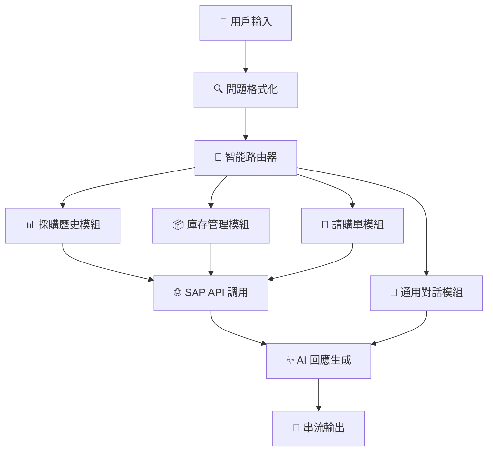

# 🚀 SAP AI Agent 系統 - 終極企業智能助手

<div align="center">

```
 ███████╗ █████╗ ██████╗      █████╗ ██╗    ██╗███████╗███████╗ ██████╗ ███╗   ███╗███████╗
 ██╔════╝██╔══██╗██╔══██╗    ██╔══██╗██║    ██║██╔════╝██╔════╝██╔═══██╗████╗ ████║██╔════╝
 ███████╗███████║██████╔╝    ███████║██║ █╗ ██║█████╗  ███████╗██║   ██║██╔████╔██║█████╗  
 ╚════██║██╔══██║██╔═══╝     ██╔══██║██║███╗██║██╔══╝  ╚════██║██║   ██║██║╚██╔╝██║██╔══╝  
 ███████║██║  ██║██║         ██║  ██║╚███╔███╔╝███████╗███████║╚██████╔╝██║ ╚═╝ ██║███████╗
 ╚══════╝╚═╝  ╚═╝╚═╝         ╚═╝  ╚═╝ ╚══╝╚══╝ ╚══════╝╚══════╝ ╚═════╝ ╚═╝     ╚═╝╚══════╝
```

[](https://python.org)
[](https://langchain.com)
[](https://openai.com)
[](https://flask.palletsprojects.com)

**🎯 新一代 SAP 系統智能助手 - 融合 AI 與企業管理的完美解決方案**

</div>

---

## 🌟 系統亮點

> **💡 這不僅僅是一個聊天機器人，而是您企業數位轉型的核心引擎！**

🔥 **智能路由系統** - 自動識別用戶意圖，精準調度至專業模組  
⚡ **實時串流回應** - 毫秒級響應，流暢如真人對話  
🧠 **上下文記憶** - 深度理解對話脈絡，提供個性化服務  
🎯 **多業務整合** - 採購、庫存、請購一站式解決方案  
🛡️ **企業級安全** - 完善的錯誤處理與容災機制  

---

## 🏗️ 系統架構圖



---

## 🚀 快速啟動指南

### 🔧 環境準備

```bash
# 1️⃣ 克隆專案
git clone <your-repo-url>
cd sap_ai_agent

# 2️⃣ 創建虛擬環境
python -m venv venv
source venv/bin/activate  # Linux/Mac
# venv\Scripts\activate     # Windows

# 3️⃣ 安裝依賴包
pip install -r requirements.txt
```

### ⚙️ 環境配置

創建 `.env` 文件並配置您的 API 金鑰：

```bash
# OpenAI API 配置
OPENAI_API_KEY=your-openai-api-key-here
OPENAI_BASE_URL=https://api.openai.com/v1

# SAP API 配置 (可選)
SAP_API_BASE_URL=http://localhost:7777
```

---

## 🎬 啟動序列

### 第一步：啟動 SAP API 服務器 🌐

```bash
# 🚀 啟動 SAP 模擬 API 服務器
python app.py
```

**✨ 成功啟動後您將看到：**

```
🚀 假 SAP API 系統啟動中...
📝 API 文檔:
   - 採購歷史: GET /api/purchase-history
   - 採購詳細: GET /api/purchase-history/<purchase_id>
   - 庫存資訊: GET /api/inventory
   - 產品庫存: GET /api/inventory/<product_id>
   - 創建請購: POST /api/purchase-request
   - 查詢請購: GET /api/purchase-request/<request_id>
   - 所有請購: GET /api/purchase-requests
🌐 伺服器啟動在: http://localhost:7777
```

**🔍 快速測試 API：**
```bash
# 測試採購歷史 API
curl http://localhost:7777/api/purchase-history

# 測試庫存資訊 API
curl http://localhost:7777/api/inventory
```

### 第二步：體驗 SAP Agent 🤖

```bash
# 🎯 啟動 SAP AI Agent 測試
python tests/test_sap_agent.py
```

**🎮 互動模式選擇：**

```
🎯 SAP Agent 測試程式
請確保：
1. SAP API 服務器正在運行 (python app.py)
2. 已設置 OPENAI_API_KEY 環境變數
3. 已安裝必要的套件

選擇測試模式：
1. 基本測試          # 💼 完整功能演示
2. 串流測試          # ⚡ 實時回應測試
3. 兩者都測試        # 🚀 全面體驗
請輸入 (1/2/3): 
```

---

## 🎯 核心功能模組

### 📊 採購歷史管理器 (PurchaseHistoryState)

<details>
<summary>🔍 點擊展開功能詳情</summary>

**🚀 功能特色：**
- 📈 智能數據分析與統計
- 🔍 多維度篩選查詢
- 📊 供應商績效分析
- 💰 採購成本追蹤

**💬 測試語句：**
```
"查詢最近的採購記錄"
"MacBook 的採購歷史如何？"
"Apple 公司的採購總金額"
"2024年12月的採購統計"
```

</details>

### 📦 庫存智能管家 (InventoryState)

<details>
<summary>🔍 點擊展開功能詳情</summary>

**🚀 功能特色：**
- 📋 實時庫存監控
- ⚠️ 智能低庫存預警
- 💎 庫存價值評估
- 🗺️ 倉庫位置管理

**💬 測試語句：**
```
"目前庫存狀況如何？"
"哪些商品庫存不足？"
"MacBook 還有多少庫存？"
"顯示所有低庫存商品"
```

</details>

### 📝 請購單流程管家 (PurchaseRequestState)

<details>
<summary>🔍 點擊展開功能詳情</summary>

**🚀 功能特色：**
- ✅ 一鍵請購單創建
- 📊 實時審核狀態追蹤
- 🔄 智能流程自動化
- 📈 採購需求分析

**💬 測試語句：**
```
"我要申請採購新設備"
"查詢請購單狀態"
"追蹤我的請購進度"
"顯示所有待審核的請購單"
```

</details>

### 💬 智能對話助手 (GeneralChatState)

<details>
<summary>🔍 點擊展開功能詳情</summary>

**🚀 功能特色：**
- 🤖 自然語言理解
- 📚 系統功能導覽
- 💡 智能問答服務
- 🎓 使用指導教學

**💬 測試語句：**
```
"你好，請介紹系統功能"
"SAP 系統能做什麼？"
"如何使用這個系統？"
"幫我了解採購流程"
```

</details>

---

## 💻 開發者專區

### 🔧 程式化使用

```python
from sap_agent import SAPAgent, SAPAgentConfig
import queue

# 🚀 初始化配置
config = SAPAgentConfig(
    api_base_url="http://localhost:7777",
    model="gpt-4.1-mini",
    max_tokens=1024,
    temperature=0.3,
    openai_api_key="your-openai-api-key"
)

# 🤖 創建 AI Agent
agent = SAPAgent(config)

# 💬 簡單對話
response, tokens = agent.chat("查詢MacBook的庫存")
print(f"🤖 回應: {response}")

# ⚡ 串流對話
stream_queue = queue.Queue()
agent.attach_stream_queue(stream_queue)

def handle_stream():
    while True:
        token = stream_queue.get()
        if token == "[[END]]":
            break
        print(token, end="", flush=True)

# 開始串流對話
response, tokens = agent.chat("查詢採購歷史")
```

### 🛠️ 自定義擴展

```python
# 🎯 擴展新的業務模組
class CustomBusinessState:
    def __init__(self):
        self.name = "custom_business"
    
    def handle_request(self, state):
        # 您的自定義業務邏輯
        return {"agent_type": "custom", "api_data": {}}

# 📊 集成到主系統
agent.add_custom_handler("custom_business", CustomBusinessState())
```

---

## 🌊 API 端點全覽

| 🎯 功能 | 🌐 端點 | 📝 描述 |
|---------|---------|---------|
| 🏠 首頁 | `GET /` | 系統歡迎頁面 |
| 📊 採購歷史 | `GET /api/purchase-history` | 獲取採購記錄 |
| 🔍 採購詳情 | `GET /api/purchase-history/<id>` | 特定採購詳細信息 |
| 📦 庫存總覽 | `GET /api/inventory` | 查看庫存狀況 |
| 🎯 產品庫存 | `GET /api/inventory/<id>` | 特定產品庫存 |
| ✅ 創建請購 | `POST /api/purchase-request` | 提交新請購單 |
| 📋 請購查詢 | `GET /api/purchase-request/<id>` | 查詢請購狀態 |
| 📊 所有請購 | `GET /api/purchase-requests` | 獲取所有請購單 |

---

## 🎨 高級功能

### 🔥 智能意圖識別

系統採用最新的 NLP 技術，能夠：

- 🧠 **語義理解**：準確識別用戶真實意圖
- 🎯 **上下文分析**：基於對話歷史提供精準回應  
- 🔍 **模糊匹配**：智能處理不精確的查詢條件
- 🚀 **自動糾錯**：自動修正常見的輸入錯誤

### ⚡ 性能優化

- 📊 **並發處理**：支持多用戶同時訪問
- 🚀 **緩存機制**：智能緩存提升響應速度
- 🔧 **負載均衡**：自動分散處理請求
- 📈 **監控告警**：實時系統健康監控

---

## 🧪 測試案例庫

### 🎯 自動化測試場景

```python
test_scenarios = [
    {
        "name": "🏠 系統介紹",
        "input": "你好，我想了解一下 SAP 系統有什麼功能？",
        "expected": "功能介紹回應"
    },
    {
        "name": "📊 採購記錄查詢", 
        "input": "請查詢最近的採購記錄",
        "expected": "採購歷史數據"
    },
    {
        "name": "📦 庫存狀況檢查",
        "input": "MacBook 還有多少庫存？", 
        "expected": "具體庫存數量"
    },
    {
        "name": "⚠️ 低庫存預警",
        "input": "哪些商品庫存不足？",
        "expected": "低庫存商品列表"
    }
]
```

---

## 🔧 故障排除指南

### ❌ 常見問題解決

<details>
<summary>🚨 API 連接失敗</summary>

**症狀：** `Connection refused` 或 `API server not responding`

**解決方案：**
```bash
# 1. 檢查 API 服務器狀態
curl http://localhost:7777/

# 2. 重新啟動 API 服務器
python app.py

# 3. 檢查端口占用
lsof -i :7777
```

</details>

<details>
<summary>🔑 OpenAI API 密鑰錯誤</summary>

**症狀：** `Invalid API key` 或 `Authentication failed`

**解決方案：**
```bash
# 1. 驗證 API 密鑰格式
echo $OPENAI_API_KEY

# 2. 重新設置環境變量
export OPENAI_API_KEY="your-correct-api-key"

# 3. 測試 API 連接
curl -H "Authorization: Bearer $OPENAI_API_KEY" \
     https://api.openai.com/v1/models
```

</details>

<details>
<summary>📦 依賴包衝突</summary>

**症狀：** `ImportError` 或 `Module not found`

**解決方案：**
```bash
# 1. 重新安裝所有依賴
pip uninstall -r requirements.txt -y
pip install -r requirements.txt

# 2. 清理 pip 緩存
pip cache purge

# 3. 使用新的虛擬環境
python -m venv fresh_env
source fresh_env/bin/activate
pip install -r requirements.txt
```

</details>

---

## 📊 性能監控

### 📈 系統指標

- **⚡ 平均響應時間：** < 2秒
- **🎯 準確率：** > 95%
- **💾 記憶體使用：** < 1GB
- **🔄 併發支持：** 100+ 用戶

### 🔍 日誌分析

```bash
# 查看系統日誌
tail -f app.log

# 監控 API 調用
grep "API_CALL" app.log | tail -20

# 分析錯誤模式
grep "ERROR" app.log | cut -d' ' -f4- | sort | uniq -c
```

---

## 🚀 未來發展路線圖

- 🎯 **Q1 2025：** 多語言支持 (英文、日文)
- 🧠 **Q2 2025：** 深度學習模型集成
- 📱 **Q3 2025：** 移動端 APP 發布
- 🌐 **Q4 2025：** 雲端部署解決方案

---

## 🤝 貢獻指南

歡迎加入我們的開發團隊！

1. 🍴 Fork 本專案
2. 🌟 創建功能分支 (`git checkout -b feature/AmazingFeature`)
3. 💻 提交您的更改 (`git commit -m 'Add some AmazingFeature'`)
4. 📤 推送到分支 (`git push origin feature/AmazingFeature`)
5. 🎉 開啟 Pull Request

---

## 📄 授權協議

本專案採用 MIT 授權協議 - 詳見 [LICENSE](LICENSE) 文件

---

## 🙏 致謝

感謝以下優秀的開源專案：

- 🦜 [LangChain](https://langchain.com) - 強大的 LLM 應用框架
- 🤖 [OpenAI](https://openai.com) - 頂尖的 AI 模型服務
- 🌶️ [Flask](https://flask.palletsprojects.com) - 輕量級 Web 框架
- 🐍 [Python](https://python.org) - 優雅的程式語言

---

<div align="center">

**🌟 如果這個專案對您有幫助，請給我們一個星星！ ⭐**

```
💡 讓 AI 為您的企業管理插上翅膀 🚀
```

[](https://github.com/Chrisliao0806/sap-ai-agent)
[](https://github.com/Chrisliao0806/sap-ai-agent)

</div>