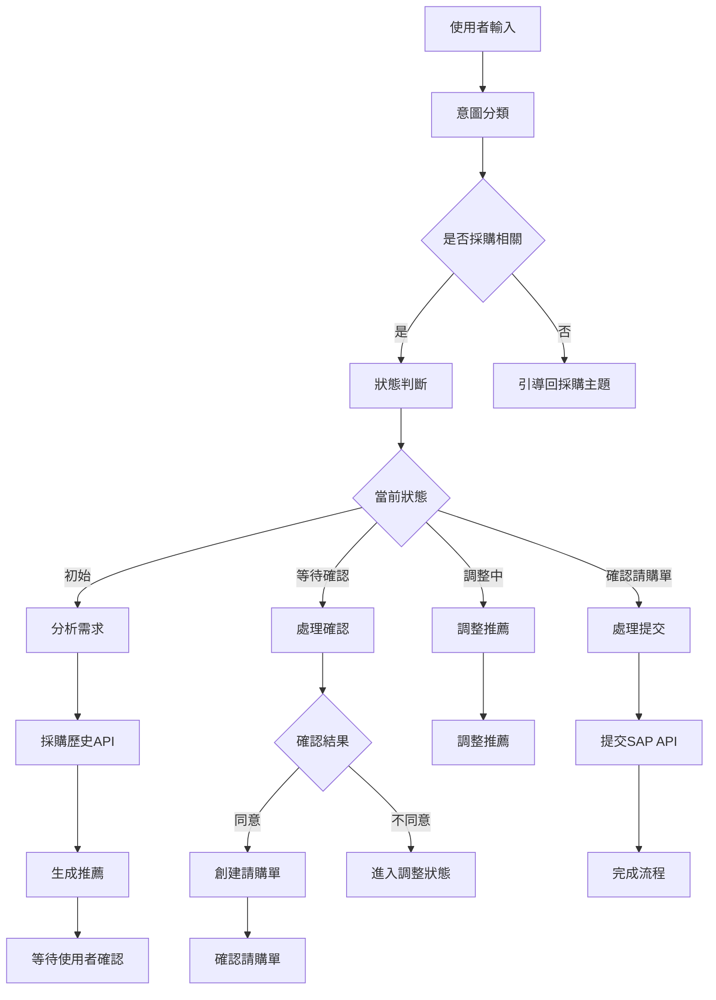

# 🛒 SAP 對話式請購系統 AI Agent

## 系統概述

這是一個基於 AI 的智能對話式請購系統，能夠：

1. **智能對話互動** - 透過自然語言對話完成請購流程
2. **意圖識別** - 自動判斷使用者意圖和對話狀態
3. **產品推薦** - 基於採購歷史推薦最適合的產品
4. **流程引導** - 引導使用者完成完整的請購流程
5. **狀態管理** - 維護多使用者會話狀態
6. **主題控制** - 自動將偏離主題的對話導回採購相關內容

## 🏗️ 系統架構



## 🚀 快速開始

### 1. 環境準備

```bash
# 克隆或下載專案
cd sap_ai_agent

# 安裝依賴
pip install -r requirements.txt

# 設定環境變數
export OPENAI_API_KEY="your-openai-api-key-here"
export OPENAI_BASE_URL="https://api.openai.com/v1"  # 可選
```

### 2. 啟動系統

**步驟 1：啟動 SAP API 服務器**
```bash
python app.py
```
系統將在 `http://localhost:7777` 啟動

**步驟 2：測試對話式系統**
```bash
# 命令行對話模式
python demo_chat.py

# 完整系統測試
python tests/test_conversational_system.py
```

### 3. 使用 API 端點

```bash
# 與 AI Agent 對話
curl -X POST http://localhost:7777/api/chat \
  -H "Content-Type: application/json" \
  -d '{"message": "我需要採購一台筆記型電腦", "session_id": "user123"}'

# 查看會話狀態
curl http://localhost:7777/api/chat/session/user123

# 重置會話
curl -X DELETE http://localhost:7777/api/chat/session/user123
```

## 💬 對話式使用範例

### 完整請購流程

```
👤 使用者: 我需要採購一台筆記型電腦，用於開發工作
🤖 AI助手: 📋 需求分析完成
          [分析結果...]
          🎯 產品推薦
          [推薦內容...]
          請問您是否同意此推薦？

👤 使用者: 同意
🤖 AI助手: 📋 請購單已創建
          [請購單詳情...]
          請確認請購單資訊是否正確？

👤 使用者: 確認提交
🤖 AI助手: ✅ 請購單提交成功！
          請購單號：PR20250704ABCDEF
          [詳細資訊...]
```

### 調整推薦流程

```
👤 使用者: 我需要採購平板電腦，預算3萬元
🤖 AI助手: [推薦結果...]

👤 使用者: 不同意，我要更便宜的選項
🤖 AI助手: 請告訴我您希望如何調整這個推薦？

👤 使用者: 預算降到2萬元
🤖 AI助手: 🔄 推薦已調整
          [調整後的推薦...]
```

### 偏離主題引導

```
👤 使用者: 今天天氣真好
🤖 AI助手: 我是專門協助您處理採購相關事務的助手。
          請告訴我您想要採購什麼產品？

👤 使用者: 我需要採購手機
🤖 AI助手: [開始分析需求...]
```

## 🎯 功能特色

### 1. 智能對話狀態管理
- **多狀態追蹤**：初始、分析、推薦、確認、調整、提交等
- **會話隔離**：每個使用者維護獨立的對話狀態
- **狀態持久化**：會話狀態在系統運行期間保持

### 2. 意圖識別與分類
- **自動意圖分類**：新請購、確認推薦、調整需求、提交請購
- **主題檢測**：識別是否為採購相關對話
- **引導機制**：自動將偏離主題的對話導回採購流程

### 3. 智能推薦與調整
- **歷史數據分析**：基於採購歷史推薦最適合的產品
- **動態調整**：根據使用者反饋調整推薦內容
- **多方案提供**：提供主要推薦和替代方案

### 4. 完整流程管理
- **步驟式引導**：逐步引導使用者完成請購流程
- **確認機制**：每個重要步驟都需要使用者確認
- **錯誤處理**：自動處理異常情況並提供解決方案

## 🔧 系統配置

### ConversationalPurchaseAgent 參數

| 參數 | 類型 | 預設值 | 說明 |
|------|------|--------|------|
| `api_base_url` | str | "http://localhost:7777" | SAP API 基礎 URL |
| `model` | str | "gpt-4o-mini" | 使用的 LLM 模型 |
| `max_tokens` | int | 1024 | 最大 Token 數量 |
| `temperature` | float | 0.3 | 模型創造性參數 |
| `openai_api_key` | str | "" | OpenAI API Key |
| `openai_base_url` | str | "https://api.openai.com/v1" | OpenAI API 基礎 URL |
| `default_requester` | str | "系統使用者" | 預設請購人 |
| `default_department` | str | "IT部門" | 預設部門 |

## 📝 API 端點

### 對話式端點

| 端點 | 方法 | 說明 |
|------|------|------|
| `/api/chat` | POST | 與 AI Agent 對話 |
| `/api/chat/session/<session_id>` | GET | 獲取會話狀態 |
| `/api/chat/session/<session_id>` | DELETE | 重置會話 |
| `/api/chat/sessions` | GET | 獲取所有會話列表 |

### 傳統端點

| 端點 | 方法 | 說明 |
|------|------|------|
| `/api/purchase-history` | GET | 獲取採購歷史 |
| `/api/inventory` | GET | 獲取庫存資訊 |
| `/api/purchase-request` | POST | 創建請購單 |
| `/api/purchase-request/<id>` | GET | 查詢請購狀態 |

## 🔍 對話狀態流程

1. **INITIAL** - 初始狀態，等待使用者輸入需求
2. **ANALYZING** - 分析使用者需求中
3. **WAITING_CONFIRMATION** - 等待使用者確認推薦
4. **ADJUSTING** - 根據使用者反饋調整推薦
5. **CONFIRMING_ORDER** - 確認請購單內容
6. **SUBMITTING** - 提交請購單到系統
7. **COMPLETED** - 請購流程完成

## 🛠️ 測試和除錯

### 運行測試

```bash
# 完整對話系統測試
python tests/test_conversational_system.py

# 命令行互動測試
python demo_chat.py

# 檢查系統狀態
curl http://localhost:7777/api/chat/sessions
```

### 測試場景

1. **基本請購流程**
   - 需求輸入 → 推薦確認 → 請購單提交

2. **調整推薦流程**
   - 需求輸入 → 推薦 → 要求調整 → 新推薦 → 確認

3. **多會話並行**
   - 同時維護多個使用者的對話狀態

4. **偏離主題處理**
   - 自動識別並引導回採購主題

## 🔐 安全考量

- **API Key 管理**：透過環境變數安全管理
- **會話隔離**：每個使用者會話完全隔離
- **輸入驗證**：對所有使用者輸入進行驗證
- **錯誤處理**：優雅處理各種異常情況

## 📈 效能優化

- **會話管理**：自動清理過期會話
- **快取機制**：快取常用的採購歷史資料
- **併發處理**：支援多使用者同時對話
- **資源控制**：限制每個會話的記憶體使用

## 🎨 自定義配置

### 修改預設設定

```python
from purchase_agent import ConversationalPurchaseAgent, PurchaseAgentConfig

config = PurchaseAgentConfig(
    api_base_url="http://your-sap-server:8080",
    model="gpt-4",
    temperature=0.1,
    default_requester="您的名字",
    default_department="您的部門"
)

agent = ConversationalPurchaseAgent(config)
```

### 自定義提示模板

您可以修改 `prompts.py` 中的提示模板來自定義 AI 的回應風格和行為。

## 🤝 貢獻指南

歡迎提交 Issue 和 Pull Request 來改善系統功能！

## 📄 授權

MIT License - 詳見 LICENSE 文件