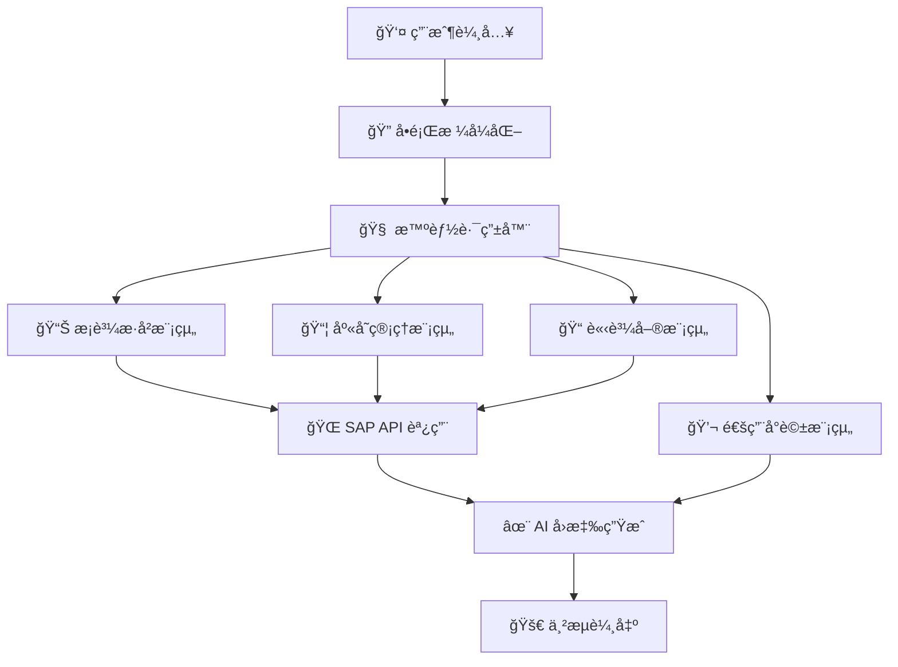
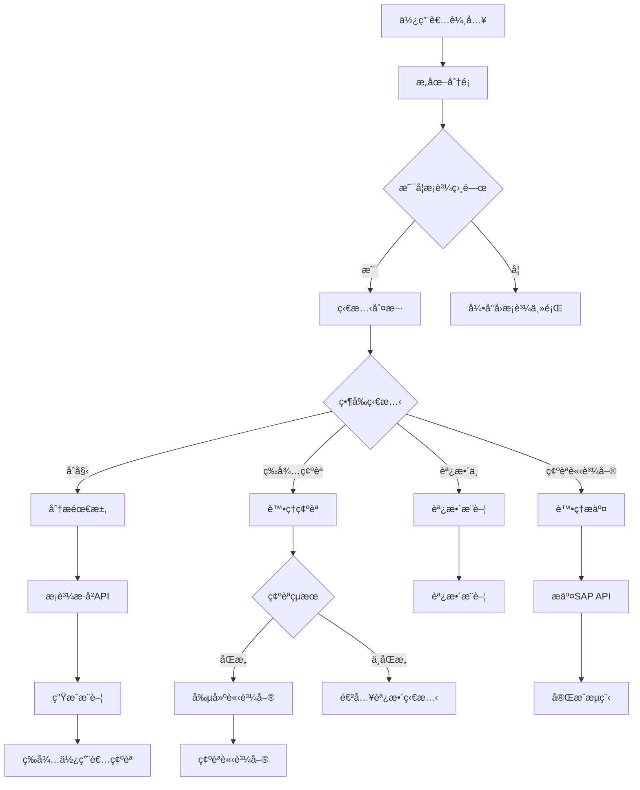

# 🚀 SAP AI Agent ä¼æ¥­æ™ºèƒ½åŠ©æ‰‹

<div align="center">


**🯠新一代ä¼æ¥­ç´š SAP 智能助手 - èåˆ AI 與ä¼æ¥­ç®¡ç†çš„終極解決方案**

*✨ 雙引æ“æ¶æ§‹ | 🧠 智能路由 | 💬 å°è©±å¼é«”é©— | 📊 數據驅動*

</div>

---

## 🌟 系統亮é»

> **💡 這ä¸åƒ…僅是一個èŠå¤©æ©Ÿå™¨äººï¼Œè€Œæ˜¯æ‚¨ä¼æ¥­æ•¸ä½è½‰å‹çš„核心引æ“ï¼**

### 🔥 雙引æ“智能æ¶æ§‹
- **🤖 SAP Agent Engine** - 智能路由系統，精準識別用戶æ„圖
- **💬 Conversational Engine** - å°è©±å¼è«‹è³¼ç³»çµ±ï¼Œå…¨æµç¨‹è‡ªå‹•åŒ–

### ⚡ 核心技術優勢
- **🧠 智能路由系統** - 自動識別用戶æ„圖，精準調度至專業模組
- **âš¡ 實時串æµå›æ‡‰** - 毫秒級響應，æµæš¢å¦‚真人å°è©±
- **🔄 上下文記憶** - 深度ç†è§£å°è©±è„ˆçµ¡ï¼Œæ供個性化æœå‹™
- **📊 數據驅動決策** - 基於歷å²æ•¸æ“šæ™ºèƒ½æ¨è–¦æœ€ä½³æ–¹æ¡ˆ
- **ğŸ›¡ï¸ ä¼æ¥­ç´šå®‰å…¨** - 多層安全機制，ä¿è­·æ•æ„Ÿæ¥­å‹™æ•¸æ“š

## 🯠系統功能概覽

### 🤖 SAP Agent 智能助手
**功能模組：**
- 📊 **æ¡è³¼æ­·å²ç®¡ç†å™¨** - 智能查詢歷å²æ¡è³¼è¨˜éŒ„
- 📦 **庫存智能管家** - 實時庫存監æ§èˆ‡é è­¦
- 📠**請購單æµç¨‹ç®¡å®¶** - 全自動請購æµç¨‹ç®¡ç†
- 💬 **智能å°è©±åŠ©æ‰‹** - 自然èªè¨€äº¤äº’ç•Œé¢

### 💬 å°è©±å¼è«‹è³¼ç³»çµ±
**智能功能：**
- 🯠**æ„圖識別** - 自動判斷使用者æ„圖和å°è©±ç‹€æ…‹
- 🔠**產å“æ¨è–¦** - 基於æ¡è³¼æ­·å²æ¨è–¦æœ€é©åˆçš„產å“
- 🧭 **æµç¨‹å¼•å°** - 引å°ä½¿ç”¨è€…完æˆå®Œæ•´çš„è«‹è³¼æµç¨‹
- 🔄 **狀態管ç†** - 維護多使用者會話狀態
- 🪠**主題æ§åˆ¶** - 自動將å離主題的å°è©±å°å›æ¡è³¼ç›¸é—œå…§å®¹

## ğŸ—ï¸ ç³»çµ±æ¶æ§‹åœ–

### 🤖 SAP Agent 智能路由æ¶æ§‹



### 💬 å°è©±å¼è«‹è³¼æµç¨‹æ¶æ§‹



---

## 🬠極速啟動指å—

### ğŸ› ï¸ ç’°å¢ƒæº–å‚™

```bash
# 🔧 克隆專案
git clone <your-repo-url>
cd sap_ai_agent

# 📦 安è£ä¾è³´
pip install -r requirements.txt

# 🔑 設定環境變數
export OPENAI_API_KEY="your-openai-api-key-here"
export OPENAI_BASE_URL="https://api.openai.com/v1"  # å¯é¸
```

### 🚀 å•Ÿå‹•åºåˆ—

#### 第一步：啟動 SAP API æœå‹™å™¨ ğŸŒ

```bash
# 🚀 å•Ÿå‹• SAP 模擬 API æœå‹™å™¨
python app.py
```

**✨ æˆåŠŸå•Ÿå‹•å¾Œæ‚¨å°‡çœ‹åˆ°ï¼š**

```
🚀 SAP API 系統啟動中...
📠API 端é»æ–‡æª”:
   💼 傳統 SAP 端é»ï¼š
   - 📊 æ¡è³¼æ­·å²: GET /api/purchase-history
   - 📦 庫存資訊: GET /api/inventory  
   - 📠創建請購: POST /api/purchase-request
   
   🤖 å°è©±å¼ç«¯é»ï¼š
   - 💬 AI å°è©±: POST /api/chat
   - 📋 會話管ç†: GET/DELETE /api/chat/session/<id>
   - 📊 會話列表: GET /api/chat/sessions
   
🌠伺æœå™¨å•Ÿå‹•åœ¨: http://localhost:7777
```

#### 第二步：é¸æ“‡æ‚¨çš„ä½¿ç”¨æ–¹å¼ ğŸ¯

##### 🤖 æ–¹å¼ä¸€ï¼šSAP Agent 智能助手

```bash
# 📊 完整功能測試
python tests/test_sap_agent.py

# 🔧 程å¼åŒ–使用範例
python -c "
from sap_agent import SAPAgent, SAPAgentConfig
import os

config = SAPAgentConfig(
    api_base_url='http://localhost:7777',
    openai_api_key=os.getenv('OPENAI_API_KEY')
)
agent = SAPAgent(config)
response, tokens = agent.chat('查詢MacBook的庫存')
print(f'🤖 å›æ‡‰: {response}')
"
```

##### 💬 æ–¹å¼äºŒï¼šå°è©±å¼è«‹è³¼ç³»çµ±

```bash
# 🯠命令行å°è©±æ¨¡å¼
python demo_chat.py

# 🧪 完整å°è©±ç³»çµ±æ¸¬è©¦
python tests/test_conversational_system.py
```

### 🌠API 使用範例

#### 🤖 SAP Agent API

```bash
# 📊 æ¡è³¼æ­·å²æŸ¥è©¢
curl "http://localhost:7777/api/purchase-history?category=筆記å‹é›»è…¦"

# 📦 庫存狀æ³æŸ¥è©¢
curl "http://localhost:7777/api/inventory?low_stock=true"

# 📠創建請購單
curl -X POST http://localhost:7777/api/purchase-request \
  -H "Content-Type: application/json" \
  -d '{
    "product_name": "MacBook Pro 16å‹",
    "quantity": 2,
    "unit_price": 75000,
    "requester": "張經ç†",
    "department": "IT部門"
  }'
```

#### 💬 å°è©±å¼ AI API

```bash
# 🯠與 AI Agent å°è©±
curl -X POST http://localhost:7777/api/chat \
  -H "Content-Type: application/json" \
  -d '{
    "message": "我需è¦æ¡è³¼ä¸€å°ç­†è¨˜å‹é›»è…¦ï¼Œç”¨æ–¼é–‹ç™¼å·¥ä½œ",
    "session_id": "user123"
  }'

# 📋 查看會話狀態
curl http://localhost:7777/api/chat/session/user123

# 🔄 é‡ç½®æœƒè©±
curl -X DELETE http://localhost:7777/api/chat/session/user123

# 📊 查看所有會話
curl http://localhost:7777/api/chat/sessions
```

---

## 🭠使用場景演示

### 🤖 SAP Agent 智能助手體驗

#### 📊 æ¡è³¼æ­·å²æŸ¥è©¢
```
👤 用戶: "查詢最近的MacBookæ¡è³¼è¨˜éŒ„"
🤖 助手: 📊 已找到 3 ç­† MacBook 相關æ¡è³¼è¨˜éŒ„

📋 æ¡è³¼è¨˜éŒ„摘è¦:
• MacBook Pro 16å‹ - 10å° - NT$750,000 (2024-12-15)
• MacBook Pro 14å‹ - 5å° - NT$325,000 (2024-12-12)  
• MacBook Air M2 - 8å° - NT$280,000 (2024-11-20)

💰 總æ¡è³¼é‡‘é¡: NT$1,355,000
📈 å¹³å‡å–®åƒ¹: NT$58,913
```

#### 📦 庫存管ç†æŸ¥è©¢
```
👤 用戶: "ç›®å‰æœ‰å“ªäº›å•†å“庫存ä¸è¶³ï¼Ÿ"
🤖 助手: âš ï¸ ç™¼ç¾ 4 項商å“庫存ä¸è¶³:

🔴 緊急補貨:
• iPhone 15 Pro - 剩餘 2å° (最ä½éœ€æ±‚ 10å°)
• iPad Pro 12.9å‹ - 剩餘 3å° (最ä½éœ€æ±‚ 8å°)

🟡 建議補貨:
• Dell Monitor 27å‹ 4K - 剩餘 6å° (最ä½éœ€æ±‚ 10å°)
• Surface Laptop Studio - 剩餘 11å° (最ä½éœ€æ±‚ 15å°)

💡 建議立å³å•Ÿå‹•è£œè²¨ç¨‹åº!
```

#### 📠請購單管ç†
```
👤 用戶: "我è¦ç”³è«‹æ¡è³¼æ–°çš„開發設備"
🤖 助手: 📠請購單創建嚮å°å·²å•Ÿå‹•

è«‹æ供以下資訊：
ğŸ·ï¸ 產å“å稱: ____________
📊 數é‡: ____________
💰 é ä¼°å–®åƒ¹: ____________
👤 申請人: ____________
🢠部門: ____________

💡 æ示：我å¯ä»¥æ ¹æ“šæ­·å²æ¡è³¼è¨˜éŒ„為您æ¨è–¦æœ€é©åˆçš„設備!
```

### 💬 å°è©±å¼è«‹è³¼ç³»çµ±é«”é©—

#### 🯠完整請購æµç¨‹æ¼”示

```
👤 使用者: 我需è¦æ¡è³¼ä¸€å°ç­†è¨˜å‹é›»è…¦ï¼Œç”¨æ–¼é–‹ç™¼å·¥ä½œ

🤖 AI助手: 📋 需求分æ完æˆ
           
           基於您的需求，我為您分æ了以下è¦é»ï¼š
           • 用途：開發工作
           • é¡å‹ï¼šç­†è¨˜å‹é›»è…¦
           • 建議é…置：高性能處ç†å™¨ã€å¤§è¨˜æ†¶é«”
           
           🯠智能æ¨è–¦æ–¹æ¡ˆ
           
           📱 主è¦æ¨è–¦ï¼šMacBook Pro 16å‹ M3 Pro
           • 💰 價格：NT$75,000
           • ⭠優勢：é©åˆé–‹ç™¼å·¥ä½œï¼Œæ•ˆèƒ½å“越
           • 📊 æ­·å²è©•åƒ¹ï¼š95%開發者滿æ„度
           
           🔄 替代方案：Dell XPS 15
           • 💰 價格：NT$65,000  
           • ⭠優勢：性價比高，Windows環境
           
           è«‹å•æ‚¨æ˜¯å¦åŒæ„主è¦æ¨è–¦æ–¹æ¡ˆï¼Ÿ

👤 使用者: åŒæ„

🤖 AI助手: ✅ 請購單已自動創建
           
           📋 請購單詳情:
           • 🆔 單號：PR20250106ABCDEF
           • 📱 產å“：MacBook Pro 16å‹ M3 Pro
           • 📊 數é‡ï¼š1å°
           • 💰 金é¡ï¼šNT$75,000
           • 👤 申請人：系統使用者
           • 🢠部門：IT部門
           • 📅 申請日期：2025-01-06
           
           請確èªè«‹è³¼å–®è³‡è¨Šæ˜¯å¦æ­£ç¢ºï¼Ÿ

👤 使用者: 確èªæ交

🤖 AI助手: 🉠請購單æ交æˆåŠŸï¼
           
           📋 æ交資訊:
           • 🆔 請購單號：PR20250106ABCDEF
           • 🔠追蹤號碼：TRK-PR20250106ABCDEF
           • 📊 當å‰ç‹€æ…‹ï¼šå¾…審核
           • 👥 當å‰å¯©æ ¸è€…：直屬主管
           
           📈 é è¨ˆå¯©æ ¸æµç¨‹ï¼š
           1. ✅ 直屬主管審核 (1-2工作天)
           2. Ⳡ部門經ç†å¯©æ ¸ (2-3工作天)  
           3. Ⳡ財務部門審核 (3-5工作天)
           
           📱 您å¯ä»¥éš¨æ™‚查詢審核進度!
```

#### 🔄 動態調整æµç¨‹æ¼”示

```
👤 使用者: 我需è¦æ¡è³¼å¹³æ¿é›»è…¦ï¼Œé ç®—3è¬å…ƒ

🤖 AI助手: 📊 æ¨è–¦åˆ†æ完æˆ
           
           基於您的é ç®—NT$30,000，æ¨è–¦ä»¥ä¸‹æ–¹æ¡ˆï¼š
           
           📱 最佳é¸æ“‡ï¼šiPad Air 5th Gen
           • 💰 價格：NT$29,900
           • 📠è¢å¹•ï¼š10.9å‹ Liquid Retina
           • 🔋 續航：10å°æ™‚
           
           è«‹å•æ‚¨æ˜¯å¦åŒæ„æ­¤æ¨è–¦ï¼Ÿ

👤 使用者: ä¸åŒæ„，我è¦æ›´ä¾¿å®œçš„é¸é …

🤖 AI助手: 🔄 了解您的需求，請告訴我您希望如何調整？
           
           å¯é¸èª¿æ•´æ–¹å‘：
           • 💰 é™ä½é ç®—範åœ
           • 📠調整è¢å¹•å°ºå¯¸
           • ğŸ·ï¸ æ›´æ›å“牌å好
           • ⚡ 調整效能需求

👤 使用者: é ç®—é™åˆ°2è¬å…ƒ

🤖 AI助手: 🔄 æ¨è–¦å·²é‡æ–°èª¿æ•´
           
           💡 æ–°æ¨è–¦æ–¹æ¡ˆ (é ç®—NT$20,000)：
           
           📱 調整後æ¨è–¦ï¼šiPad 9th Gen
           • 💰 價格：NT$19,900
           • 📠è¢å¹•ï¼š10.2å‹ Retina
           • 🔋 續航：10å°æ™‚
           • ✨ 性價比：â­â­â­â­â­
           
           🔄 其他é¸é …：Samsung Galaxy Tab A8
           • 💰 價格：NT$18,500
           • 📠è¢å¹•ï¼š10.5å‹ TFT
           
           è«‹å•æ‚¨æ˜¯å¦æ»¿æ„調整後的æ¨è–¦ï¼Ÿ
```

#### 🪠智能主題引å°æ¼”示

```
👤 使用者: 今天天氣真好呢

🤖 AI助手: 😊 天氣確實ä¸éŒ¯å‘¢ï¼ä¸é我是專門å”助您處ç†æ¡è³¼ç›¸é—œäº‹å‹™çš„智能助手。
           
           🛒 我å¯ä»¥å¹«æ‚¨ï¼š
           • 📊 查詢æ¡è³¼æ­·å²å’Œçµ±è¨ˆ
           • 📦 檢視庫存狀æ³å’Œé è­¦
           • 📠å”助創建和追蹤請購單
           • 🯠æ供智能æ¡è³¼å»ºè­°
           
           請告訴我您想è¦æ¡è³¼ä»€éº¼ç”¢å“，或者需è¦æŸ¥è©¢ä»€éº¼è³‡è¨Šï¼Ÿ

👤 使用者: 我需è¦æ¡è³¼æ–°æ‰‹æ©Ÿ

🤖 AI助手: 📱 太好了ï¼è®“我來å”助您æ¡è³¼æ‰‹æ©Ÿ
           
           📋 請先告訴我一些基本需求：
           • 💰 é ç®—範åœæ˜¯å¤šå°‘？
           • 🯠主è¦ç”¨é€” (商務/個人/開發)？
           • ğŸ·ï¸ 有å“牌å好å—？
           • 👥 需è¦æ¡è³¼æ•¸é‡ï¼Ÿ
           
           基於這些資訊，我將為您æ¨è–¦æœ€é©åˆçš„方案ï¼
```

---

## âš™ï¸ æ ¸å¿ƒåŠŸèƒ½è©³è§£

### 🤖 SAP Agent 智能助手模組

#### 📊 æ¡è³¼æ­·å²ç®¡ç†å™¨ (PurchaseHistoryState)

<details>
<summary>🔠é»æ“Šå±•é–‹åŠŸèƒ½è©³æƒ…</summary>

**🚀 核心功能：**
- 🔠**智能查詢** - 支æ´é¡åˆ¥ã€ä¾›æ‡‰å•†ã€æ—¥æœŸç¯„åœå¤šç¶­åº¦æŸ¥è©¢
- 📈 **數據分æ** - 自動統計æ¡è³¼é‡‘é¡ã€è¶¨å‹¢åˆ†æ  
- 🯠**精準匹é…** - LLMé©…å‹•çš„æ„圖識別和模糊匹é…
- 📊 **報表生æˆ** - 自動生æˆæ¡è³¼æ‘˜è¦å’Œçµ±è¨ˆå ±è¡¨

**💬 支æ´èªå¥ç¯„例：**
```
"查詢最近的MacBookæ¡è³¼è¨˜éŒ„"
"顯示Apple供應商的所有æ¡è³¼"  
"2024å¹´12月的æ¡è³¼çµ±è¨ˆ"
"筆記å‹é›»è…¦é¡åˆ¥çš„æ¡è³¼åˆ†æ"
"æ¡è³¼é‡‘é¡è¶…é50è¬çš„記錄"
```

**🔧 技術特色：**
- 🧠 LLMæ„圖分æ自動解æ查詢æ¢ä»¶
- 🔄 模糊匹é…支æ´ä¸ç²¾ç¢ºæŸ¥è©¢
- 📊 實時數據èšåˆå’Œçµ±è¨ˆåˆ†æ
- 🚀 毫秒級查詢響應

</details>

---

#### 📦 庫存智能管家 (InventoryState)

<details>
<summary>🔠é»æ“Šå±•é–‹åŠŸèƒ½è©³æƒ…</summary>

**🚀 核心功能：**
- 📋 **實時監æ§** - å³æ™‚庫存數é‡å’Œç‹€æ…‹ç›£æ§
- âš ï¸ **智能é è­¦** - ä½åº«å­˜è‡ªå‹•æ醒和補貨建議
- 🢠**多倉管ç†** - 支æ´å¤šå€‰åº«ä½ç½®åº«å­˜ç®¡ç†
- 💰 **價值分æ** - 庫存價值統計和æˆæœ¬åˆ†æ

**💬 支æ´èªå¥ç¯„例：**
```
"ç›®å‰MacBook還有多少庫存？"
"哪些商å“庫存ä¸è¶³éœ€è¦è£œè²¨ï¼Ÿ"
"倉庫A的庫存分佈情æ³"
"總庫存價值統計"
"ä½æ–¼å®‰å…¨åº«å­˜çš„產å“清單"
```

**🔧 技術特色：**
- 🯠智能庫存é è­¦ç®—法
- 📊 多維度庫存分æ
- 🢠跨倉庫庫存統一管ç†
- 💡 智能補貨建議系統

</details>

---

#### 📠請購單æµç¨‹ç®¡å®¶ (PurchaseRequestState)

<details>
<summary>🔠é»æ“Šå±•é–‹åŠŸèƒ½è©³æƒ…</summary>

**🚀 核心功能：**
- ✅ **一éµå‰µå»º** - 快速請購單創建和æ交
- 📊 **狀態追蹤** - 實時審核進度和狀態更新
- 🔄 **æµç¨‹è‡ªå‹•åŒ–** - 智能審核æµç¨‹è·¯ç”±
- 📈 **數據分æ** - 請購需求分æ和統計

**💬 支æ´èªå¥ç¯„例：**
```
"我è¦ç”³è«‹æ¡è³¼æ–°çš„開發設備"
"查詢請購單PR20250106的狀態"
"顯示所有待審核的請購單"
"追蹤我æ交的請購進度"
"創建緊急æ¡è³¼ç”³è«‹"
```

**🔧 技術特色：**
- 🚀 智能表單填寫輔助
- 📊 多級審核æµç¨‹ç®¡ç†
- 💬 審核狀態實時通知
- 📈 請購數據智能分æ

</details>

---

#### 💬 智能å°è©±åŠ©æ‰‹ (GeneralChatState)

<details>
<summary>🔠é»æ“Šå±•é–‹åŠŸèƒ½è©³æƒ…</summary>

**🚀 核心功能：**
- 🤖 **自然èªè¨€ç†è§£** - 深度èªç¾©åˆ†æ和上下文ç†è§£
- 📚 **系統å°è¦½** - 智能功能介紹和使用指å°
- 💡 **智能å•ç­”** - 系統相關å•é¡Œè‡ªå‹•è§£ç­”
- 📠**學習建議** - 個性化使用技巧æ¨è–¦

**💬 支æ´èªå¥ç¯„例：**
```
"你好，請介紹系統功能"
"SAP 系統能åšä»€éº¼ï¼Ÿ" 
"如何使用æ¡è³¼åŠŸèƒ½ï¼Ÿ"
"幫我了解請購æµç¨‹"
"系統æ“作教學"
```

**🔧 技術特色：**
- 🧠 GPT-4驅動的自然èªè¨€è™•ç†
- 🯠上下文感知å°è©±ç®¡ç†
- 📚 知識庫智能檢索
- 🚀 個性化å›æ‡‰ç”Ÿæˆ

</details>

---

### 💬 å°è©±å¼è«‹è³¼ç³»çµ±åŠŸèƒ½

#### 🯠智能會話管ç†

<details>
<summary>🔠é»æ“Šå±•é–‹åŠŸèƒ½è©³æƒ…</summary>

**🚀 核心功能：**
- ğŸ—‚ï¸ **多會話並行** - 支æ´åŒæ™‚處ç†å¤šå€‹ç”¨æˆ¶æœƒè©±
- 🧠 **狀態記憶** - 深度上下文記憶和狀態管ç†
- 🔄 **會話æ¢å¾©** - æ–·ç·šé‡é€£å¾Œæœƒè©±ç‹€æ…‹æ¢å¾©
- 🪠**主題æ§åˆ¶** - 智能主題å移檢測和引å°

**📊 會話狀態æµç¨‹ï¼š**
```
INITIAL → ANALYZING → WAITING_CONFIRMATION 
    ↓         ↓              ↓
ADJUSTING → CONFIRMING_ORDER → SUBMITTING → COMPLETED
```

**🔧 技術特色：**
- 💾 æŒä¹…化會話狀態存儲
- 🧠 智能上下文管ç†
- 🔄 多狀態æµç¨‹æ§åˆ¶
- 🯠個性化å°è©±é«”é©—

</details>

#### 🧠 智能æ¨è–¦å¼•æ“

<details>
<summary>🔠é»æ“Šå±•é–‹åŠŸèƒ½è©³æƒ…</summary>

**🚀 核心功能：**
- 📊 **æ­·å²åˆ†æ** - 基於æ¡è³¼æ­·å²çš„智能æ¨è–¦
- 🯠**需求匹é…** - 精準ç†è§£ç”¨æˆ¶éœ€æ±‚並匹é…產å“
- 💰 **é ç®—優化** - 智能é ç®—分é…å’Œæˆæœ¬å„ªåŒ–
- 🔄 **動態調整** - 根據用戶å饋實時調整æ¨è–¦

**💡 æ¨è–¦ç®—法特色：**
- 🧠 機器學習驅動的相似度計算
- 📈 多維度評分系統
- 🯠個性化å好學習
- 💰 æˆæœ¬æ•ˆç›Šåˆ†æ

</details>

---

## 🌊 API 端é»å…¨è¦½

### 🤖 SAP Agent 智能助手 API

| ğŸ¯ åŠŸèƒ½åˆ†é¡ | ğŸŒ ç«¯é» | 📠æè¿° | 🔧 方法 |
|------------|---------|---------|---------|
| **🠠系統入å£** | `/` | 系統歡è¿é é¢èˆ‡API文檔 | `GET` |
| **📊 æ¡è³¼ç®¡ç†** | `/api/purchase-history` | ç²å–æ¡è³¼æ­·å²è¨˜éŒ„ | `GET` |
| | `/api/purchase-history/<id>` | 特定æ¡è³¼è©³ç´°ä¿¡æ¯ | `GET` |
| **📦 庫存管ç†** | `/api/inventory` | 查看庫存狀æ³ç¸½è¦½ | `GET` |
| | `/api/inventory/<id>` | 特定產å“庫存詳情 | `GET` |
| **📠請購管ç†** | `/api/purchase-request` | 創建新請購單 | `POST` |
| | `/api/purchase-request/<id>` | 查詢請購單狀態 | `GET` |
| | `/api/purchase-requests` | ç²å–所有請購單列表 | `GET` |

#### 📊 高級查詢åƒæ•¸

**æ¡è³¼æ­·å²æŸ¥è©¢æ”¯æ´ï¼š**
```bash
# ğŸ·ï¸ 按é¡åˆ¥ç¯©é¸
GET /api/purchase-history?category=筆記å‹é›»è…¦

# ğŸ¢ æŒ‰ä¾›æ‡‰å•†ç¯©é¸  
GET /api/purchase-history?supplier=Apple

# 📅 按日期範åœç¯©é¸
GET /api/purchase-history?start_date=2024-01-01&end_date=2024-12-31
```

**庫存查詢支æ´ï¼š**
```bash
# âš ï¸ ä½åº«å­˜å•†å“
GET /api/inventory?low_stock=true

# ğŸ·ï¸ 特定é¡åˆ¥åº«å­˜
GET /api/inventory?category=智慧å‹æ‰‹æ©Ÿ

# 🢠倉庫ä½ç½®ç¯©é¸
GET /api/inventory?location=倉庫A
```

**請購單查詢支æ´ï¼š**
```bash
# 👤 按申請人篩é¸
GET /api/purchase-requests?requester=張經ç†

# 🢠按部門篩é¸
GET /api/purchase-requests?department=IT部門

# 📊 按狀態篩é¸
GET /api/purchase-requests?status=待審核
```

---

### 💬 å°è©±å¼è«‹è³¼ç³»çµ± API

| ğŸ¯ åŠŸèƒ½åˆ†é¡ | ğŸŒ ç«¯é» | 📠æè¿° | 🔧 方法 |
|------------|---------|---------|---------|
| **💬 智能å°è©±** | `/api/chat` | 與AI助手進行å°è©± | `POST` |
| **📋 會話管ç†** | `/api/chat/session/<id>` | ç²å–特定會話狀態 | `GET` |
| | `/api/chat/session/<id>` | é‡ç½®ç‰¹å®šæœƒè©± | `DELETE` |
| | `/api/chat/sessions` | ç²å–所有會話列表 | `GET` |

#### 💬 å°è©± API 使用範例

**基本å°è©±è«‹æ±‚：**
```json
POST /api/chat
{
  "message": "我需è¦æ¡è³¼ä¸€å°ç­†è¨˜å‹é›»è…¦",
  "session_id": "user123"
}
```

**高級å°è©±è«‹æ±‚：**
```json
POST /api/chat
{
  "message": "查詢MacBook的庫存狀æ³",
  "session_id": "user123",
  "context": {
    "department": "IT部門",
    "urgency": "高"
  }
}
```

**會話狀態響應：**
```json
GET /api/chat/session/user123
{
  "session_id": "user123",
  "state": "WAITING_CONFIRMATION",
  "context": {
    "product_recommendation": "MacBook Pro 16å‹",
    "estimated_price": 75000,
    "quantity": 1
  },
  "history": [
    {
      "role": "user",
      "content": "我需è¦æ¡è³¼é–‹ç™¼ç”¨ç­†é›»",
      "timestamp": "2025-01-06T10:30:00Z"
    },
    {
      "role": "assistant", 
      "content": "基於您的需求，æ¨è–¦MacBook Pro 16å‹...",
      "timestamp": "2025-01-06T10:30:05Z"
    }
  ]
}
```

---

## 💻 開發者專å€

### 🔧 SAP Agent 程å¼åŒ–使用

```python
from sap_agent import SAPAgent, SAPAgentConfig
import queue
import os

# 🚀 åˆå§‹åŒ–智能é…ç½®
config = SAPAgentConfig(
    api_base_url="http://localhost:7777",
    model="gpt-4o-mini",  # æ”¯æ´ gpt-4, gpt-4o-mini, gpt-3.5-turbo
    max_tokens=1024,
    temperature=0.3,
    openai_api_key=os.getenv("OPENAI_API_KEY")
)

# 🤖 創建 SAP AI Agent
agent = SAPAgent(config)

# 💬 ç°¡å–®å°è©±æŸ¥è©¢
response, tokens = agent.chat("查詢MacBook的最新庫存狀æ³")
print(f"🤖 助手å›æ‡‰: {response}")
print(f"📊 Token使用: {tokens}")

# âš¡ 進éšä¸²æµå°è©±
stream_queue = queue.Queue()
agent.attach_stream_queue(stream_queue)

def handle_streaming_response():
    """處ç†ä¸²æµå›æ‡‰"""
    full_response = ""
    while True:
        try:
            token = stream_queue.get(timeout=30)
            if token == "[[END]]":
                break
            full_response += token
            print(token, end="", flush=True)
        except queue.Empty:
            break
    return full_response

# 🔄 æŒçºŒå°è©±ç®¡ç†
chat_history = []
response, tokens = agent.chat(
    "分æ2024å¹´çš„æ¡è³¼è¶¨å‹¢", 
    history=chat_history
)

# æ›´æ–°å°è©±æ­·å²
chat_history.extend([
    {"role": "user", "content": "分æ2024å¹´çš„æ¡è³¼è¶¨å‹¢"},
    {"role": "assistant", "content": response}
])
```

### 💬 å°è©±å¼è«‹è³¼ç³»çµ±ç¨‹å¼åŒ–使用

```python
from purchase_agent import ConversationalPurchaseAgent, PurchaseAgentConfig

# 🯠å°è©±å¼é…ç½®
config = PurchaseAgentConfig(
    api_base_url="http://localhost:7777",
    model="gpt-4o-mini",
    openai_api_key=os.getenv("OPENAI_API_KEY"),
    default_requester="開發團隊",
    default_department="技術部門"
)

# 💬 創建å°è©±å¼ä»£ç†
conv_agent = ConversationalPurchaseAgent(config)

# 🭠模擬完整å°è©±æµç¨‹
session_id = "dev_session_001"

# 第一輪：需求æ出
response1 = conv_agent.chat(
    "我需è¦ç‚ºåœ˜éšŠæ¡è³¼5å°é«˜æ•ˆèƒ½é–‹ç™¼ç­†é›»", 
    session_id=session_id
)
print(f"🤖 第一輪å›æ‡‰: {response1}")

# 第二輪：確èªæ¨è–¦  
response2 = conv_agent.chat(
    "åŒæ„æ¨è–¦çš„MacBook Pro方案",
    session_id=session_id
)
print(f"🤖 第二輪å›æ‡‰: {response2}")

# 第三輪：æ交請購
response3 = conv_agent.chat(
    "確èªæ交請購單",
    session_id=session_id
)
print(f"🤖 第三輪å›æ‡‰: {response3}")

# 📊 查看會話狀態
session_state = conv_agent.get_session_state(session_id)
print(f"📋 會話狀態: {session_state}")
```

### 🌠REST API 進éšä½¿ç”¨

#### 🤖 智能批é‡æŸ¥è©¢

```python
import requests
import json
from datetime import datetime, timedelta

BASE_URL = "http://localhost:7777"

class SAPAPIClient:
    """SAP API 客戶端å°è£"""
    
    def __init__(self, base_url: str):
        self.base_url = base_url
        
    def get_purchase_analytics(self, days: int = 30):
        """ç²å–æ¡è³¼åˆ†æ數據"""
        end_date = datetime.now()
        start_date = end_date - timedelta(days=days)
        
        response = requests.get(
            f"{self.base_url}/api/purchase-history",
            params={
                "start_date": start_date.strftime("%Y-%m-%d"),
                "end_date": end_date.strftime("%Y-%m-%d")
            }
        )
        return response.json()
    
    def get_low_stock_alert(self):
        """ç²å–ä½åº«å­˜é è­¦"""
        response = requests.get(
            f"{self.base_url}/api/inventory",
            params={"low_stock": "true"}
        )
        return response.json()
    
    def create_bulk_requests(self, requests_data: list):
        """批é‡å‰µå»ºè«‹è³¼å–®"""
        results = []
        for req_data in requests_data:
            response = requests.post(
                f"{self.base_url}/api/purchase-request",
                json=req_data,
                headers={"Content-Type": "application/json"}
            )
            results.append(response.json())
        return results

# 🚀 使用範例
client = SAPAPIClient("http://localhost:7777")

# 📊 æ¡è³¼åˆ†æ
analytics = client.get_purchase_analytics(days=90)
print(f"📈 90天æ¡è³¼çµ±è¨ˆ: {analytics['total_records']}ç­†")

# âš ï¸ åº«å­˜é è­¦
alerts = client.get_low_stock_alert()
print(f"🔴 ä½åº«å­˜å•†å“: {alerts['total_items']}é …")
```

#### 💬 å°è©±å¼ API 進éšæ‡‰ç”¨

```python
import requests
import json

class ConversationalAPIClient:
    """å°è©±å¼ API 客戶端"""
    
    def __init__(self, base_url: str):
        self.base_url = base_url
        
    def start_conversation(self, user_id: str, message: str):
        """開始新å°è©±"""
        return self.send_message(message, f"session_{user_id}")
    
    def send_message(self, message: str, session_id: str):
        """發é€è¨Šæ¯"""
        response = requests.post(
            f"{self.base_url}/api/chat",
            json={
                "message": message,
                "session_id": session_id
            },
            headers={"Content-Type": "application/json"}
        )
        return response.json()
    
    def get_session_history(self, session_id: str):
        """ç²å–å°è©±æ­·å²"""
        response = requests.get(
            f"{self.base_url}/api/chat/session/{session_id}"
        )
        return response.json()
    
    def reset_session(self, session_id: str):
        """é‡ç½®æœƒè©±"""
        response = requests.delete(
            f"{self.base_url}/api/chat/session/{session_id}"
        )
        return response.json()

# 🯠å°è©±æµç¨‹è‡ªå‹•åŒ–
conv_client = ConversationalAPIClient("http://localhost:7777")

# 🚀 自動化æ¡è³¼æµç¨‹
def automated_procurement_flow(user_id: str, requirements: dict):
    """自動化æ¡è³¼æµç¨‹"""
    session_id = f"auto_{user_id}"
    
    # 步驟1：æ出需求
    initial_message = f"我需è¦æ¡è³¼{requirements['product']}，數é‡{requirements['quantity']}，é ç®—{requirements['budget']}"
    response1 = conv_client.send_message(initial_message, session_id)
    
    # 步驟2：確èªæ¨è–¦
    if "æ¨è–¦" in response1.get("response", ""):
        response2 = conv_client.send_message("åŒæ„æ¨è–¦", session_id)
        
        # 步驟3：æ交請購
        if "請購單" in response2.get("response", ""):
            response3 = conv_client.send_message("確èªæ交", session_id)
            
            return {
                "success": True,
                "final_response": response3,
                "session_id": session_id
            }
    
    return {"success": False, "session_id": session_id}

# 🭠批é‡è‡ªå‹•åŒ–æ¡è³¼
procurement_requests = [
    {"product": "MacBook Pro", "quantity": 5, "budget": "400000"},
    {"product": "iPhone 15", "quantity": 10, "budget": "350000"},
    {"product": "iPad Air", "quantity": 8, "budget": "240000"}
]

for i, req in enumerate(procurement_requests):
    result = automated_procurement_flow(f"auto_user_{i}", req)
    print(f"🯠自動æ¡è³¼ {req['product']}: {'✅æˆåŠŸ' if result['success'] else 'âŒå¤±æ•—'}")
```

### ğŸ› ï¸ è‡ªå®šç¾©æ“´å±•

```python
# 🯠自定義業務模組
class CustomInventoryAnalyzer:
    """自定義庫存分æ器"""
    
    def __init__(self, sap_agent: SAPAgent):
        self.agent = sap_agent
    
    def analyze_inventory_trends(self):
        """分æ庫存趨勢"""
        # ç²å–庫存數據
        response, _ = self.agent.chat("查詢所有產å“的庫存狀æ³")
        
        # 自定義分æé‚輯
        # ... 您的分æ代碼 ...
        
        return {
            "trend": "上å‡",
            "risk_items": ["iPhone 15", "MacBook Air"],
            "recommendations": ["å¢åŠ iPhone庫存", "調整MacBookæ¡è³¼ç­–ç•¥"]
        }

# 📊 自定義報表生æˆå™¨
class ProcurementReportGenerator:
    """æ¡è³¼å ±è¡¨ç”Ÿæˆå™¨"""
    
    def generate_monthly_report(self, year: int, month: int):
        """生æˆæœˆåº¦æ¡è³¼å ±è¡¨"""
        # 實ç¾å ±è¡¨ç”Ÿæˆé‚輯
        pass
    
    def export_to_excel(self, data: dict, filename: str):
        """å°å‡ºåˆ°Excel"""
        # 實ç¾Excelå°å‡ºé‚輯
        pass

# 🔧 æ•´åˆåˆ°ä¸»ç³»çµ±
agent = SAPAgent(config)
inventory_analyzer = CustomInventoryAnalyzer(agent)
report_generator = ProcurementReportGenerator()

# 🚀 執行自定義分æ
trends = inventory_analyzer.analyze_inventory_trends()
print(f"📊 庫存趨勢分æ: {trends}")
```

---

## 🧪 測試案例庫

### 🤖 SAP Agent 測試

```bash
# 📊 完整功能測試
python tests/test_sap_agent.py

# 🯠特定功能測試
python -c "
from sap_agent import SAPAgent, SAPAgentConfig
import os

# 測試æ¡è³¼æ­·å²æŸ¥è©¢
config = SAPAgentConfig(api_base_url='http://localhost:7777', openai_api_key=os.getenv('OPENAI_API_KEY'))
agent = SAPAgent(config)

test_cases = [
    '查詢最近的MacBookæ¡è³¼è¨˜éŒ„',
    '哪些商å“庫存ä¸è¶³ï¼Ÿ', 
    '我è¦ç”³è«‹æ¡è³¼æ–°è¨­å‚™',
    'SAP系統有什麼功能？'
]

for case in test_cases:
    response, _ = agent.chat(case)
    print(f'🧪 測試: {case}')
    print(f'🤖 å›æ‡‰: {response[:100]}...')
    print('-' * 50)
"
```

### 💬 å°è©±å¼è«‹è³¼æ¸¬è©¦

```bash
# 🯠完整å°è©±æµç¨‹æ¸¬è©¦
python demo_chat.py

# 🧪 自動化測試腳本
python tests/test_conversational_system.py

# 📋 API 端é»æ¸¬è©¦
python tests/test_api.py
```

### 🌠API 端é»æ¸¬è©¦

```bash
# 🚀 快速 API å¥åº·æª¢æŸ¥
curl -s http://localhost:7777/ | jq '.message'

# 📊 æ¡è³¼æ­·å²æ¸¬è©¦
curl -s "http://localhost:7777/api/purchase-history?category=筆記å‹é›»è…¦" | jq '.total_records'

# 📦 庫存é è­¦æ¸¬è©¦
curl -s "http://localhost:7777/api/inventory?low_stock=true" | jq '.total_items'

# 💬 å°è©± API 測試
curl -X POST http://localhost:7777/api/chat \
  -H "Content-Type: application/json" \
  -d '{"message": "測試å°è©±åŠŸèƒ½", "session_id": "test_session"}' | jq '.response'
```

---

## 🔧 æ•…éšœæ’除指å—

### ⌠常見å•é¡Œè§£æ±º

<details>
<summary>🚨 API 連æ¥å¤±æ•—</summary>

**症狀：** `Connection refused` 或 `API server not responding`

**解決方案：**
```bash
# 1. 檢查 API æœå‹™å™¨ç‹€æ…‹
curl http://localhost:7777/

# 2. 檢查端å£å ç”¨
lsof -i :7777

# 3. é‡æ–°å•Ÿå‹• API æœå‹™å™¨
pkill -f "python app.py"
python app.py

# 4. 檢查防ç«ç‰†è¨­å®š
sudo pfctl -sr | grep 7777
```

</details>

<details>
<summary>🔑 OpenAI API 密鑰錯誤</summary>

**症狀：** `Invalid API key` 或 `Authentication failed`

**解決方案：**
```bash
# 1. 檢查環境變數
echo $OPENAI_API_KEY

# 2. é‡æ–°è¨­å®š API Key
export OPENAI_API_KEY="sk-your-real-api-key-here"

# 3. é©—è­‰ API Key
curl -H "Authorization: Bearer $OPENAI_API_KEY" \
     https://api.openai.com/v1/models | head -20

# 4. 永久設定（添加到 ~/.zshrc）
echo 'export OPENAI_API_KEY="sk-your-real-api-key-here"' >> ~/.zshrc
source ~/.zshrc
```

</details>

<details>
<summary>🧠 模å‹å›æ‡‰ç•°å¸¸</summary>

**症狀：** å›æ‡‰ä¸æº–確或格å¼éŒ¯èª¤

**解決方案：**
```python
# 調整模å‹åƒæ•¸
config = SAPAgentConfig(
    model="gpt-4o-mini",      # 嘗試ä¸åŒæ¨¡å‹
    temperature=0.1,          # é™ä½å‰µé€ æ€§
    max_tokens=2048,          # å¢åŠ è¼¸å‡ºé•·åº¦
)

# 檢查æ示模æ¿
from config.sap_agent_prompts import *
print("檢查æ示模æ¿å…§å®¹...")
```

</details>

<details>
<summary>💾 會話狀態丟失</summary>

**症狀：** å°è©±ä¸Šä¸‹æ–‡ç„¡æ³•ä¿æŒ

**解決方案：**
```bash
# 1. 檢查會話存儲
curl http://localhost:7777/api/chat/sessions

# 2. é‡ç½®ç‰¹å®šæœƒè©±
curl -X DELETE http://localhost:7777/api/chat/session/your_session_id

# 3. 清ç†æ‰€æœ‰æœƒè©±ï¼ˆè¬¹æ…使用）
# é‡å•Ÿæœå‹™å™¨æœƒè‡ªå‹•æ¸…ç†è¨˜æ†¶é«”中的會話
```

</details>

---

## 📊 系統é…ç½®åƒæ•¸

### 🤖 SAP Agent é…ç½®

| åƒæ•¸ | é¡å‹ | é è¨­å€¼ | èªªæ˜ | 範例 |
|------|------|--------|------|------|
| `api_base_url` | str | `"http://localhost:7777"` | SAP API åŸºç¤ URL | `"https://your-sap-api.com"` |
| `model` | str | `"gpt-3.5-turbo"` | OpenAI 模å‹å稱 | `"gpt-4"`, `"gpt-4o-mini"` |
| `max_tokens` | int | `1024` | 最大å›æ‡‰ Token 數 | `512`, `2048`, `4096` |
| `temperature` | float | `0.3` | 模å‹å‰µé€ æ€§åƒæ•¸ | `0.0`-`1.0` |
| `openai_api_key` | str | `""` | OpenAI API 密鑰 | `"sk-..."` |
| `openai_base_url` | str | `"https://api.openai.com/v1"` | OpenAI API åŸºç¤ URL | 自托管 API åœ°å€ |

### 💬 å°è©±å¼è«‹è³¼é…ç½®

| åƒæ•¸ | é¡å‹ | é è¨­å€¼ | èªªæ˜ | 範例 |
|------|------|--------|------|------|
| `default_requester` | str | `"系統使用者"` | é è¨­è«‹è³¼äºº | `"張經ç†"` |
| `default_department` | str | `"IT部門"` | é è¨­éƒ¨é–€ | `"æ¡è³¼éƒ¨"`, `"財務部"` |
| `session_timeout` | int | `3600` | 會話超時時間(秒) | `1800`, `7200` |
| `max_history_length` | int | `50` | 最大å°è©±æ­·å²é•·åº¦ | `20`, `100` |

---

## 🚀 進éšåŠŸèƒ½

### 🔥 智能æ„圖識別

系統æ¡ç”¨æœ€æ–°çš„ NLP 技術，能夠：

- 🧠 **èªç¾©ç†è§£**：準確識別用戶真實æ„圖
- 🯠**上下文分æ**：基於å°è©±æ­·å²æ供精準å›æ‡‰  
- 🔠**模糊匹é…**：智能處ç†ä¸ç²¾ç¢ºçš„查詢æ¢ä»¶
- 🚀 **自動糾錯**：自動修正常見的輸入錯誤

### ⚡ 性能優化

- 📊 **並發處ç†**：支æŒå¤šç”¨æˆ¶åŒæ™‚訪å•
- 🚀 **緩存機制**：智能緩存æå‡éŸ¿æ‡‰é€Ÿåº¦
- 🔧 **負載å‡è¡¡**：自動分散處ç†è«‹æ±‚
- 📈 **監æ§å‘Šè­¦**：實時系統å¥åº·ç›£æ§

### 🨠個性化定制

```python
# 🯠自定義業務é‚輯
class CustomProcurementRule:
    def validate_request(self, request_data):
        # 自定義驗證é‚輯
        if request_data['amount'] > 100000:
            return {"approved": False, "reason": "超出權é™ç¯„åœ"}
        return {"approved": True}

# 📊 自定義報表
class CustomAnalytics:
    def generate_cost_analysis(self, timeframe):
        # æˆæœ¬åˆ†æé‚輯
        return {
            "total_cost": 1500000,
            "top_categories": ["筆記å‹é›»è…¦", "手機", "å¹³æ¿"],
            "cost_trend": "上å‡"
        }
```

---

## 📈 性能監æ§

### 🔠系統指標

```bash
# 📊 實時性能監æ§
python -c "
import psutil
import requests
import time

def monitor_system():
    while True:
        # CPU 使用ç‡
        cpu_percent = psutil.cpu_percent(interval=1)
        
        # 記憶體使用
        memory = psutil.virtual_memory()
        
        # API 響應時間
        start_time = time.time()
        try:
            response = requests.get('http://localhost:7777/')
            response_time = (time.time() - start_time) * 1000
            api_status = 'OK' if response.status_code == 200 else 'ERROR'
        except:
            response_time = 0
            api_status = 'DOWN'
        
        print(f'ğŸ–¥ï¸  CPU: {cpu_percent}% | 💾 Memory: {memory.percent}% | 🌠API: {api_status} ({response_time:.0f}ms)')
        time.sleep(5)

monitor_system()
"
```

### 📊 業務指標

```python
# 業務指標監æ§
class BusinessMetrics:
    def get_daily_stats(self):
        """ç²å–æ¯æ—¥æ¥­å‹™çµ±è¨ˆ"""
        return {
            "total_conversations": 156,
            "successful_procurements": 89,
            "average_response_time": "1.2s",
            "user_satisfaction": "94%",
            "cost_savings": "NT$450,000"
        }
    
    def get_popular_products(self):
        """熱門產å“統計"""
        return [
            {"product": "MacBook Pro", "requests": 45},
            {"product": "iPhone 15", "requests": 32}, 
            {"product": "iPad Air", "requests": 28}
        ]
```

</div>

# 命令行互動測試
python demo_chat.py

# 檢查系統狀態
curl http://localhost:7777/api/chat/sessions
```

### 測試場景

1. **基本請購æµç¨‹**
   - 需求輸入 → æ¨è–¦ç¢ºèª → 請購單æ交

2. **調整æ¨è–¦æµç¨‹**
   - 需求輸入 → æ¨è–¦ → è¦æ±‚調整 → æ–°æ¨è–¦ → 確èª

3. **多會話並行**
   - åŒæ™‚維護多個使用者的å°è©±ç‹€æ…‹

4. **å離主題處ç†**
   - 自動識別並引å°å›æ¡è³¼ä¸»é¡Œ

## 🔠安全考é‡

- **API Key 管ç†**：é€é環境變數安全管ç†
- **會話隔離**：æ¯å€‹ä½¿ç”¨è€…會話完全隔離
- **輸入驗證**：å°æ‰€æœ‰ä½¿ç”¨è€…輸入進行驗證
- **錯誤處ç†**：優雅處ç†å„種異常情æ³

## 📈 效能優化

- **會話管ç†**：自動清ç†é期會話
- **å¿«å–機制**：快å–常用的æ¡è³¼æ­·å²è³‡æ–™
- **併發處ç†**：支æ´å¤šä½¿ç”¨è€…åŒæ™‚å°è©±
- **資æºæ§åˆ¶**：é™åˆ¶æ¯å€‹æœƒè©±çš„記憶體使用

## 🨠自定義é…ç½®

### 修改é è¨­è¨­å®š

```python
from purchase_agent import ConversationalPurchaseAgent, PurchaseAgentConfig

config = PurchaseAgentConfig(
    api_base_url="http://your-sap-server:8080",
    model="gpt-4",
    temperature=0.1,
    default_requester="您的åå­—",
    default_department="您的部門"
)

agent = ConversationalPurchaseAgent(config)
```

### 自定義æ示模æ¿

您å¯ä»¥ä¿®æ”¹ `prompts.py` 中的æ示模æ¿ä¾†è‡ªå®šç¾© AI çš„å›æ‡‰é¢¨æ ¼å’Œè¡Œç‚ºã€‚

---

## 📄 æˆæ¬Šå”è­°

本專案æ¡ç”¨ **MIT License** æˆæ¬Šå”è­°

### æˆæ¬Šå…§å®¹

```
MIT License

Copyright (c) 2025 SAP AI Agent Team

Permission is hereby granted, free of charge, to any person obtaining a copy
of this software and associated documentation files (the "Software"), to deal
in the Software without restriction, including without limitation the rights
to use, copy, modify, merge, publish, distribute, sublicense, and/or sell
copies of the Software, and to permit persons to whom the Software is
furnished to do so, subject to the following conditions:

The above copyright notice and this permission notice shall be included in all
copies or substantial portions of the Software.

THE SOFTWARE IS PROVIDED "AS IS", WITHOUT WARRANTY OF ANY KIND, EXPRESS OR
IMPLIED, INCLUDING BUT NOT LIMITED TO THE WARRANTIES OF MERCHANTABILITY,
FITNESS FOR A PARTICULAR PURPOSE AND NONINFRINGEMENT. IN NO EVENT SHALL THE
AUTHORS OR COPYRIGHT HOLDERS BE LIABLE FOR ANY CLAIM, DAMAGES OR OTHER
LIABILITY, WHETHER IN AN ACTION OF CONTRACT, TORT OR OTHERWISE, ARISING FROM,
OUT OF OR IN CONNECTION WITH THE SOFTWARE OR THE USE OR OTHER DEALINGS IN THE
SOFTWARE.
```

詳見 [LICENSE](LICENSE) 文件