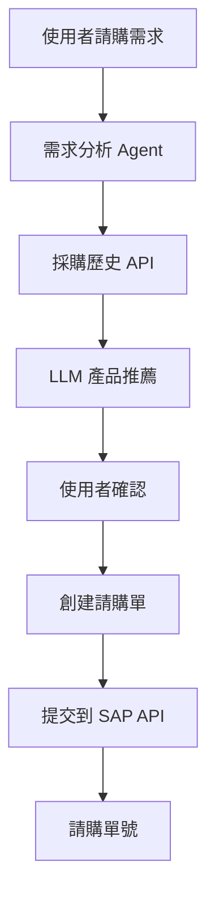

# 🛒 SAP 請購系統 AI Agent

## 系統概述

這是一個基於 AI 的智能請購系統，能夠：

1. **智能需求分析** - 分析使用者的請購需求
2. **歷史數據分析** - 調用採購歷史 API 獲取相關數據
3. **產品推薦** - 基於歷史數據和需求推薦最佳產品規格
4. **自動化請購** - 創建並提交請購單到 SAP 系統

## 🏗️ 系統架構



## 🚀 快速開始

### 1. 環境準備

```bash
# 克隆或下載專案
cd sap_ai_agent

# 安裝依賴
pip install -r requirements.txt

# 設定環境變數
cp .env.example .env
# 編輯 .env 檔案，填入您的 OpenAI API Key
```

### 2. 設定環境變數

在 `.env` 檔案中設定：

```bash
OPENAI_API_KEY=your-openai-api-key-here
OPENAI_BASE_URL=https://api.openai.com/v1
SAP_API_BASE_URL=http://localhost:7777
```

### 3. 啟動系統

**步驟 1：啟動 SAP API 服務器**
```bash
python app.py
```

**步驟 2：測試請購系統**
```bash
# 簡單演示
python demo_purchase.py

# 完整測試
python test_purchase_system.py

# 直接使用模組
python purchase_agent.py
```

## 📋 使用範例

### 基本使用

```python
from purchase_agent import PurchaseAgent, PurchaseAgentConfig
import os

# 建立配置
config = PurchaseAgentConfig(
    api_base_url="http://localhost:7777",
    model="gpt-4o-mini",
    openai_api_key=os.getenv("OPENAI_API_KEY")
)

# 建立 Agent
agent = PurchaseAgent(config)

# 處理請購需求
request = "我需要為軟體開發部門採購 MacBook Pro，記憶體16GB以上，需要3台"
result, tokens = agent.process_purchase_request(request)

print(f"處理結果: {result}")
print(f"Token 使用量: {tokens}")
```

### 串流模式

```python
import queue
import threading

# 設定串流佇列
stream_queue = queue.Queue()
agent.attach_stream_queue(stream_queue)

# 處理串流輸出
def handle_stream():
    while True:
        token = stream_queue.get()
        if token == "[[END]]":
            break
        print(token, end="", flush=True)

# 啟動串流處理
stream_thread = threading.Thread(target=handle_stream)
stream_thread.start()

# 處理請購
result, tokens = agent.process_purchase_request(request)
stream_thread.join()
```

## 🎯 功能特色

### 1. 智能需求分析
- 自動解析請購需求中的產品類型、數量、預算等關鍵資訊
- 識別業務部門和使用用途
- 提取時間需求和優先級

### 2. 歷史數據智能分析
- 自動調用採購歷史 API 獲取相關數據
- 分析供應商表現和價格趨勢
- 識別最佳採購時機和規格

### 3. 產品推薦引擎
- 基於歷史採購數據推薦最適合的產品
- 提供多個替代方案
- 考慮成本效益和供應商可靠性

### 4. 自動化流程
- 自動創建符合規範的請購單
- 一鍵提交到 SAP 系統
- 實時追蹤請購狀態

## 📊 測試案例

系統內建多種測試案例：

1. **軟體開發部門筆電需求**
   ```
   我需要為軟體開發部門採購新的筆記型電腦，要求MacBook Pro，記憶體16GB以上，需要3台，預算每台7.5萬元。
   ```

2. **設計部門顯示器需求**
   ```
   設計部門需要4K顯示器，27吋，需要5台，預算每台2萬元以內。
   ```

3. **行銷部門平板需求**
   ```
   行銷部門需要iPad Pro用於客戶展示，12.9吋，需要2台。
   ```

## 🔧 系統配置

### PurchaseAgentConfig 參數說明

| 參數 | 類型 | 預設值 | 說明 |
|------|------|--------|------|
| `api_base_url` | str | "http://localhost:7777" | SAP API 基礎 URL |
| `model` | str | "gpt-4o-mini" | 使用的 LLM 模型 |
| `max_tokens` | int | 1024 | 最大 Token 數量 |
| `temperature` | float | 0.3 | 模型創造性參數 |
| `openai_api_key` | str | "" | OpenAI API Key |
| `openai_base_url` | str | "https://api.openai.com/v1" | OpenAI API 基礎 URL |

## 📝 API 端點

系統使用以下 SAP API 端點：

- `GET /api/purchase-history` - 獲取採購歷史
- `POST /api/purchase-request` - 創建請購單
- `GET /api/purchase-request/{id}` - 查詢請購狀態

## 🔍 工作流程詳解

1. **需求分析** (`analyze_request`)
   - 解析使用者輸入的請購需求
   - 提取關鍵資訊（產品類型、數量、預算等）

2. **獲取歷史數據** (`fetch_purchase_history`)
   - 調用採購歷史 API
   - 獲取相關的歷史採購記錄

3. **產品推薦** (`recommend_product`)
   - 分析歷史數據和使用者需求
   - 生成產品推薦和替代方案

4. **創建請購單** (`create_purchase_order`)
   - 根據推薦結果創建正式請購單
   - 包含所有必要欄位和資訊

5. **提交請購** (`submit_purchase_order`)
   - 將請購單提交到 SAP 系統
   - 返回請購單號和狀態

6. **生成回應** (`generate_final_response`)
   - 生成最終的處理結果
   - 提供請購單號和追蹤資訊

## 🛠️ 測試和除錯

### 運行測試

```bash
# 基本功能測試
python test_purchase_system.py

# 選擇測試模式：
# 1. 基本功能測試
# 2. 串流回應測試
# 3. 互動模式
# 4. 錯誤處理測試
# 5. 完整測試
```

### 常見問題

1. **API 連接失敗**
   - 確保 SAP API 服務器正在運行：`python app.py`
   - 檢查 API URL 設定是否正確

2. **OpenAI API 錯誤**
   - 確認 API Key 設定正確
   - 檢查網路連線和 API 配額

3. **請購單創建失敗**
   - 檢查請購數據格式是否正確
   - 確認所有必要欄位都已填入

## 🔐 安全考量

- API Key 應該透過環境變數設定，不要直接寫在代碼中
- 生產環境應該使用 HTTPS 連接
- 請購單應該包含適當的驗證和授權機制

## 📈 效能優化

- 使用串流模式提供即時回饋
- 快取常用的採購歷史數據
- 優化 LLM 提示以減少 Token 消耗

## 🤝 貢獻指南

歡迎提交 Issue 和 Pull Request 來改善系統功能！

## 📄 授權

MIT License - 詳見 LICENSE 文件